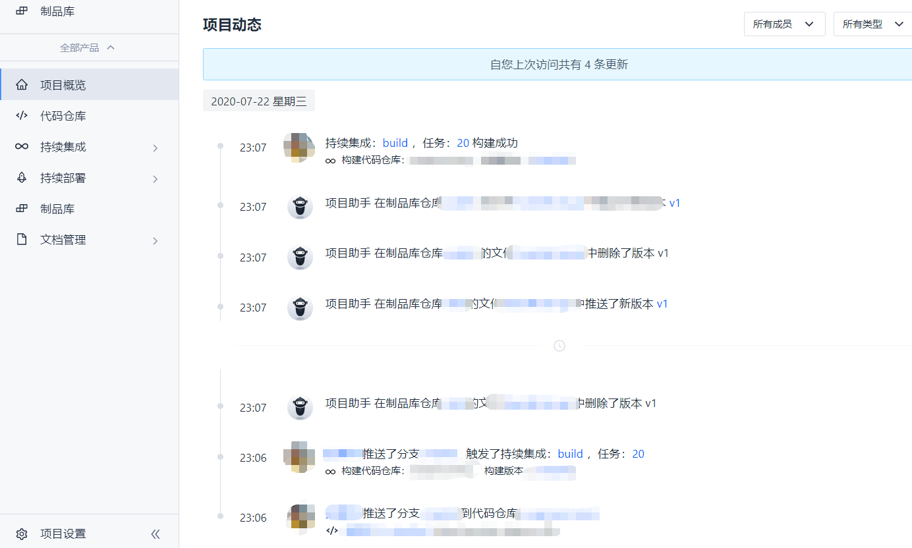
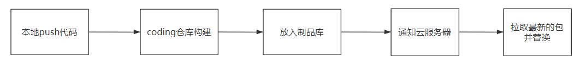
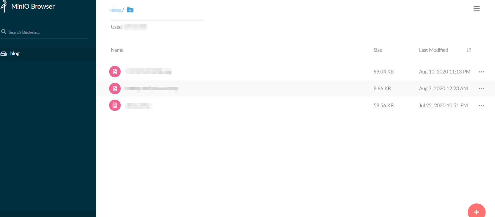

+++
title = "重构博客"
date = "2020-06-19"
author = "naeco"
[taxonomies]
tags = ["blog", "minio"]
+++

### vuepress

​	我的博客初版采用的是`Hexo`，一开始感觉挺好用的，但后面用着用着发现配置文件太多太复杂了，我对于博客只有几点要求：简洁、标签和可定制，所以`Hexo`很多的功能基本上都用不到。后面`Vue`也出了自己的静态站点生成器[VuePress](https://vuepress.vuejs.org/)，现在迭代得也挺完善了，所以就基于此工具重新构建了博客。

​	`VuePress`预置了博客和文档的主题，博客的主题简洁优雅，十分对我的口味。博客配置文件也非常简单，以本站点为例子，只使用了60行左右的代码进行配置，省心省力，下面分享一下我的配置：

```javascript
module.exports = {
  // 博客标题
  title: 'naeco',
  // 博客描述信息
  description: '',
  // dev端口
  port: 9999,
  // haed内容
  head: [
    ['link', { rel: 'icon', href: '/favicon.icon' }],
    ['link', { rel: 'manifest', href: '/manifest.json' }],
    ['meta', { name: 'theme-color', content: '#ff6348' }],
    ['meta', { name: 'apple-mobile-web-app-capable', content: 'yes' }],
    ['meta', { name: 'apple-mobile-web-app-status-bar-style', content: 'black' }],
    ['link', { rel: 'apple-touch-icon', href: '/icons.png' }],
    ['link', { rel: 'mask-icon', href: '/mask.svg', color: '#ff6348' }],
    ['meta', { name: 'msapplication-TileImage', content: '/icons.png' }],
    ['meta', { name: 'msapplication-TileColor', content: 'rgb(51, 51, 51)' }]
  ],
  // markdown配置
  markdown: {
    lineNumbers: false
  },
  // 使用es6代码, 不兼容低版本浏览器
  evergreen: true,
  // 第三方主题
  theme: '@vuepress/theme-blog',
  themeConfig: {
    smoothScroll: true,
    // 日期格式化
    dateFormat: 'YYYY-MM-DD',
    // 导航内容
    nav: [
      { text: '主页', link: '/' },
      { text: '标签', link: '/tag/' },
      { text: '关于', link: '/about/' }
    ],
    // 底部内容
    footer: {
      contact: [
        {
          type: 'github',
          link: 'https://github.com/naecoo'
        }
      ],
      copyright: [
        {
          text: 'MIT Licensed | Copyright © 2018-present',
          link: '/copyright/',
        }
      ]
    },
    //  分页
    globalPagination: {
      prevText: '上一页',
      nextText: '下一页',
      lengthPerPage: '7',
      layout: 'Pagination'
    },
    // pwa支持
    pwa: {
      serviceWorker: true,
      updatePopup: {
        message: '发现新内容可用',
        buttonText: 'refresh'
      }
    }
  },
  // 插件
  plugins: ['@vuepress/back-to-top']
}
```

​	迁移到`VuePress`之后，我终于可以专心写作，不用再捣鼓一些配置文件了，十分舒服省心。

### 利用coding进行持续集成

​	

 	

​	这里其实和vuepress本身没关系，hexo也可以利用coding进行持续集成。本来我的博客是放在github上面的，但国内访问github速度感人，加上博客访问人群主要也在国内，所以就将博客迁移到自己的云服务器，加快访问速度。我们希望每次push代码，博客会自动更新并部署，同时coding支持持续集成、持续部署和制品库等功能，完全免费，速度也很快。于是就将博客迁移到了coding，博客CI流程大概是这样的：



​	可以看到，大部分的流程都是在coding上完成的，大大减轻了服务器的压力。

### 私有图床搭建



​	私有图床采用的是minio，方法也很简单，minio官方提供了部署的docker镜像，一条命令就可以在机器上部署好，再修改一下nginx的配置就可以完成一个简单的图床系统，具体的操作请看[详细教程](https://azhuge233.com/使用-minio-nginx-dotnet-core-搭建图床/)。后续我会出写一篇博文专门介绍如何搭建私有图床，从minio的搭建到Typora的粘贴上传脚本编写。

### 后续
​	博客的持续部署流程还是有一点粗糙，还有在服务器写一段脚本监听仓库的更新事件，其实这些可以用webhook实现的，或者用Caddy替换掉nginx，Caddy内置了webhook，还支持免费的https，等有时间的时候，可以用接入Caddy重构一波。