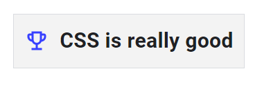
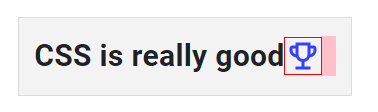
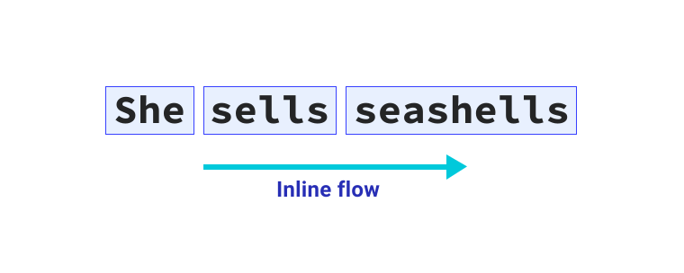
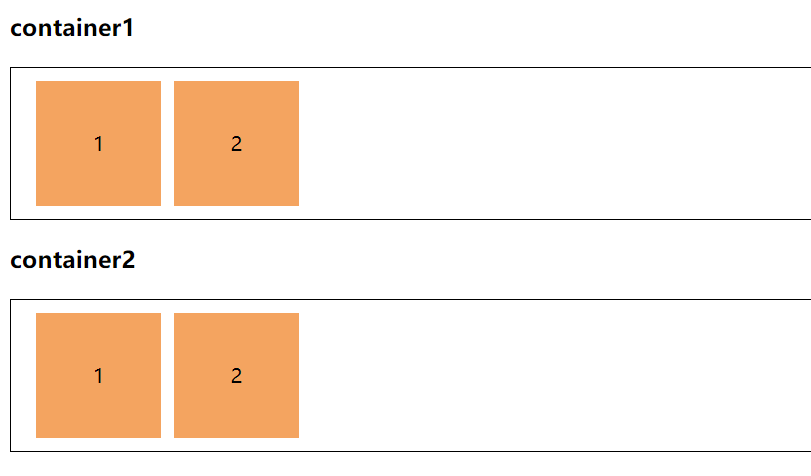
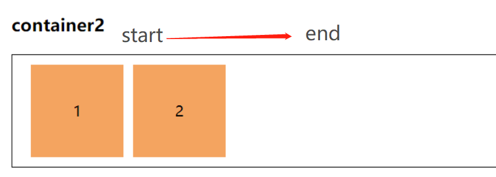
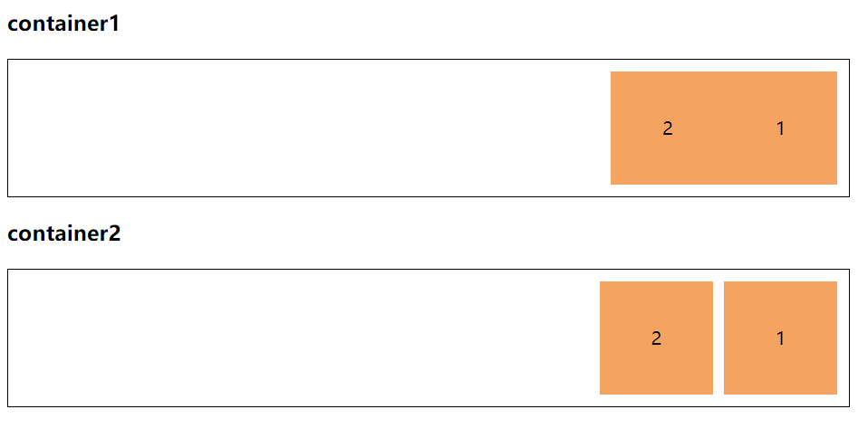
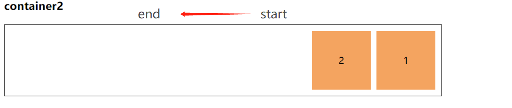
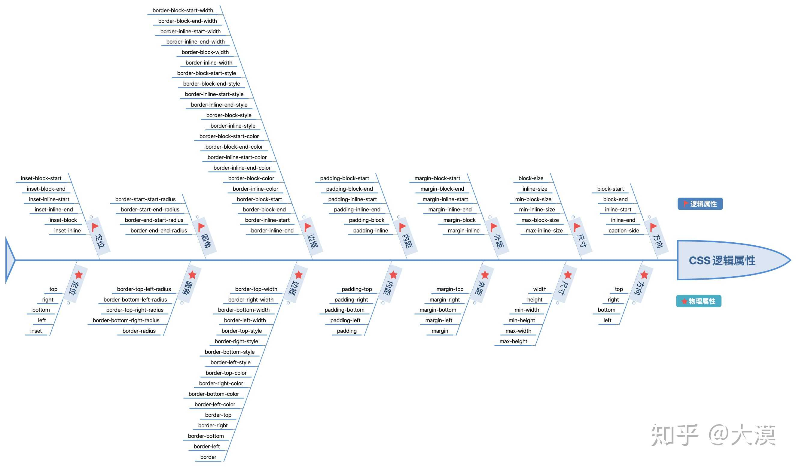

+++
title = "CSS逻辑属性"
date = "2021-06-27"
author = "naeco"
[taxonomies]
tags = ["css"]
+++

## 前言

​		传统的CSS属性大多是采用物理属性来定义的，比如元素的尺寸，偏移和边距等属性。但是随着业务的发展，越来越多的web应用需要考虑到国家化，必须适配不同的语言。大部分国家的语言排版都是从左到右，即LTR(left to right)，但是仍然有一部分语言采用的是从右到左，即RTL(right to left)的版本布局，比如阿拉伯语和希伯来语等。

​	但是仅凭靠现有的物理属性，CSS很难处理多语言的业务场景，比如下面这个简单的例子：



一个图标和一行文本，要求是文本距离图标要有一定的间距。如果按照传统的思路，我们可能直接加一个外边距就处理完成了：

```html
// 代表icon
<svg class="icon">....</svg>
<span class="text">CSS is really good</span>
```


```css
.icon {
    margin-right: 0.5em;
}
```

但是，当我们面对RTL的文本排版时，效果将会变成这样：



很显然这是不符合实际需求的，为了兼容，我们不得不进行类似的处理:

```css
html[lang="ar"] .icon {
    margin-right： 0;
    margin-left: 0.5em;
}
```

​		虽然这只是一个简单的例子，但也表明为了编写兼容多种语言的web页面，前端开发人员不得不做大量重复繁琐的样式调正，所以我们迫切需要一种新特性，可以让开发者根据书写模式来维护布局的完整性。幸运的是，CSS工作组也看到了这种困境，提出了[CSS逻辑属性（CSS Logical Properties and Values Level 1）](https://www.w3.org/TR/css-logical-1/#intro)的这一特性，下面，我们将详细介绍该特性


## 什么是逻辑属性

​	

​		传统CSS盒子模型中的top、right、bottom和left代表了UI视图在物理维度上的属性，与显示屏幕的方向保持一致，而css逻辑属性则和文档流排版的方向保持一致，这意味着逻辑属性可以根据文档流排版方向的改变而改变。首先我们要搞清楚什么是文档流的排版方向，在默认情况下，文档流的排版是从右到左，从上到下。而HTML的`dir`属性和CSS的`direction`、`writing-mode`，甚至是`flex`和`grid`等属性都可以改变文档的排版方向。一旦改变了文档排版方向，物理属性的左右上下就失去了意义，因为这些属性并没有和文档流的方向关联起来。因此，在CSS的逻辑属性中，并没有方向的概念，只有开始(`start`)和结束(`end`)，又由于web页面是二维的布局，所以也包含块(`block`)和内联(`inline`)的概念。

### 块状流(block flow)

​		块状流就是块状元素排列的方向，英文和中文默认方向是从顶部到底部，类似于`flex`布局的主轴。


### 内联流(inline flow)

​		内联流就是内联元素或者文本排列的方向，英文和中文默认方向是从左边到右边，类似于`flex`布局的交叉轴。



​		block flow和inline flow的方向并不是固定的，可以用过HTML的`dir`属性，CSS的`direction`和`writing-mode`等属性进行变更，总之block flow就是块状元素堆叠的方向，inline flow就是内联元素和文本排列的方向。通过设定不同的`writing-mode`，block flow可以变成从底部到顶部、从左到右甚至是从右到左，inline flow同理，`wrigin-mode`的使用方法可以参考[MDN]([writing-mode - CSS: Cascading Style Sheets | MDN (mozilla.org)](https://developer.mozilla.org/en-US/docs/Web/CSS/writing-mode))。

​		在CSS逻辑属性中，不再需要使用`top`、`right`、`bottom`和`right`等物理属性了描述方向了，取而代之的是`start`和`end`。比如，按照正常的文档流（英文），`margin-top`属性可以改为`margin-block-start`，`margin-bottom`改为`margin-block-end`，`margin-left`改为`margin-inline-start`，`margin-right`改为`margin-inline-end`，`padding`和`border`也是有相应的转换，如下图所示：


我们可以简单对比一下两者的差异：

HTML代码：

```html
  <h3>container1</h3>
  <div class="container">
    <div class="box">1</div>
    <div class="box">2</div>
  </div>

  <h3>container2</h3>
  <div class="container">
    <div class="box">1</div>
    <div class="box">2</div>
  </div>
```

CSS代码

```css
	:root {
      --size: 100px;
    }

    .container {
      display: flex;
      margin-top: 20px;
      padding: 10px;
      border: 1px solid #000;
    }

    .box {
      width: var(--size);
      height: var(--size);
      line-height: var(--size);
      text-align: center;
      background-color: sandybrown;
    }

    .container:nth-of-type(1) .box:last-child {
      margin-left: 10px;
    }

    .container:nth-of-type(2) .box:last-child {
      margin-inline-start: 10px;
    }
```

结果：



​		可以看出来，当设定正常的文档版本方向时，两者结果是一样的，黄色box都有10px的左边距。因为此时是正常的文档流，inline flow是从左到右，也就是`direction: ltr`的效果，此时inline flow的方向是这样的：

`direction: ltr`: 




​	我们可以尝试改变一下`direction`，看看效果：

CSS代码：

```css
	:root {
      --size: 100px;
    }

    .container {
      display: flex;
      margin-top: 20px;
      padding: 10px;
      border: 1px solid #000;

	  // inline flow修改为从右到左方向
      direction: rtl;
    }

    .box {
      width: var(--size);
      height: var(--size);
      line-height: var(--size);
      text-align: center;
      background-color: sandybrown;
    }

    .container:nth-of-type(1) .box:last-child {
      margin-left: 10px;
    }

    .container:nth-of-type(2) .box:last-child {
      margin-inline-start: 10px;
    }
```

结果：



​		很明显可以看出来，第一个container的box设置的是物理属性，当文档排版方向发生改变，布局效果就失去了效果，因为container1下的box元素设定的是物理属性，是固定不变的。而container2下的box设置的逻辑属性会随着排版方向变化的变化，在从右到左的布局中，`start`变成了右边开始，`end`变成了左边，所以布局效果不会受到影响。

`direction: rtl`



​		CSS逻辑属性的优势就体现与此，其设定的值能够从逻辑角度（排版方向）控制布局，而不是基于物理维度。

## 逻辑属性介绍

​		CSS的逻辑属性不仅仅包括`margin`，下面我们将逐个介绍认识，下面的例子描述都是基于正常的英文文档流，inline flow为从左到右，block flow为从上到下。


### 方向

​		传统的定位属性是`top`，`right`、`bottom`和`left`，基于逻辑属性，我们采用`start`和`end`来代替。

​		比如向右对齐文本:

```css
p {
    text-align: right;
}
```

​		现在我们采用:

```p
p {
	text-align: end;
}
```

​		同样的，在定位系统中，我们可以使用`block-{start|end}`和`inline-{start|end}`属性，比如，基于英文文档排版方向，使元素向上偏移10px，向右偏移20px：

```css
.element {
    position: absolute;
    block-start: 10px;
    inline-start: 20px;
}

```

​		如果是基于物理属性：

```css
.element {
    position: absolute;
    top: 10px;
    left: 20px;
}
```


### 尺寸

​		相对应的，元素尺寸也有了新的写法，`width`改为`inline-size`代替，`height`改为`block-size`，如果我们像限定元素宽200px，高100px，可以这样书写：

```css
.element {
    inline-size: 200px;
    block-size: 100px;
}
```

​		不仅如此，最大最小尺寸也可以用逻辑属性来代替，比如限定一个元素最大宽度为150px，最小高度为200px：

```css
.element {
    max-inline-size: 150px;
    min-block-size: 200px;
}
```


### 内外边距

​		前文已经提到逻辑属性中的外边距，其实内边距也是一样的，抛弃物理属性后，现在书写边距将会采用`{padding|margin}-{block|inline}-{start-end}`和`{padding|margin}-{block|inline}`两种模式的属性书写，我们先来看第一个，比方为元素添加右外边距20px、上外边距10px，同时添加30px下外边距：

```css
.element {
    margin-inline-start: 20px;
    margin-block-start: 20px;
    margin-block-end: 30px;
}
```

​		有时候，为每一个属性单独设置值是没有必要的，CSS逻辑属性同时也提供了简写的方式：

```css
.element {
    margin-block: 10px 20px;  /* 分别设置开始和结束值 */
    margin-block: 10%; /* 同时设置开始值和结束值 */

    /* 关键字 值 */
    margin-block: auto;

    /* 全局 值 */
    margin-block: inherit;
    margin-block: initial;
    margin-block: unset;
}
```

​		内边距的属性和外边距是一样的，把`margin`换成`padding`即可。


### 边框

​		`border`和`border-radius`也可以通过CSS逻辑属性设置，比方在底部和右侧添加边框，并在右侧添加5px的`border-radius`：

```css
.element {
    border-bottom: 1px solid red;
  	border-right: 1px solid red;
  	border-bottom-right-radius: 5px;
}
```

​		边框可以设定的参数很多，所以衍生出来的逻辑属性也非常多，在此就不一一罗列了，可以参考[MDN文档](https://developer.mozilla.org/en-US/docs/Web/CSS/CSS_Logical_Properties#properties_for_margins_borders_and_padding)去了解，不管是简写还是具体值设定，都有相关的介绍。

### 定位

​		前面提到，当`top`和`left`等作为物理属性时，可以用相对应的逻辑属性代替。理所当然的，当`top`、`left`、`right`和`bottom`作为属性名的时候，比如作为定位属性使用的时候，CSS逻辑属性也有提供`inset-{block|inline}`和`inser-{block|inline}-{start|end}`两种模式的属性作为代替。比方说这样的样式：

```css
.element {
    position: relative;
    top: 20px;
    right: 10px;
}
```

​		可以改为：

```css
.element {
    position: relative;
    inset-block-start: 20px;
    inset-inline-end: 10px;
}
```

​		也可以用简写

```css
.element {
    position: relative;
    inset-block: 20px 0;
    inset-inline: 0 10px;
}
```


## 总结

​	下面一张图可以看到逻辑属性和物理属性的对比：



​		我们一直习惯使用物理属性 `left`、`right`、`top`、`bottom` 描述盒模型，但是这些属性受制于书写模式，一旦书写模式改变，物理属性也随之改变，从而造成问题。但在逻辑属性中却不一样，因为逻辑属性中没有方向性的概念，不受书写模式的干扰。从现在开始，请尽可能的使用逻辑属性，减少使用物理属性，让CSS更加自然、灵活和贴切。

​		最后，我们看一下CSS逻辑属性的浏览器支持性，请确保你的用户群体浏览器版本属于这一范围:

​	


## 参考

- [css-logical-properties](https://web.dev/learn/css/logical-properties)
- ["logic" | Can I use... Support tables for HTML5, CSS3, etc](https://caniuse.com/?search=logic)
- [CSS Logical Properties | CSS-Tricks](https://css-tricks.com/css-logical-properties/)
- [Understanding Logical Properties And Values — Smashing Magazine](https://www.smashingmagazine.com/2018/03/understanding-logical-properties-values/)
- [CSS 逻辑属性与值 - CSS（层叠样式表） | MDN (mozilla.org)](https://developer.mozilla.org/zh-CN/docs/Web/CSS/CSS_Logical_Properties)
- [CSS逻辑属性和物理属性之间的映射关系](https://www.zhihu.com/pin/1250489765822078976)

