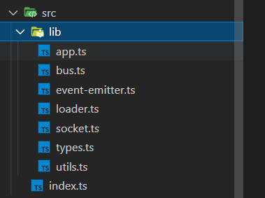
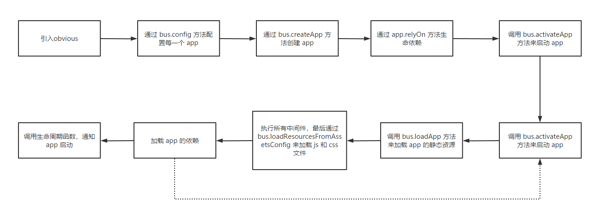

+++
title = "obvious - 微前端框架分析"
date = "2021-09-05"
author = "naeco"
[taxonomies]
tags = ["javascript"]
+++


## 前言

前几天，阮一峰在他的[周刊](https://www.ruanyifeng.com/blog/2021/08/weekly-issue-173.html)上介绍了一个国产的微前端框架 [obvious](https://github.com/ObviousJs/obvious-core) ，实现得很简洁，本文就带大家从源码角度分析该框架。


## obvious框架介绍

obvious 是一个渐进式微前端库，在微前端架构中，obvious 专注于解决前端微应用的依赖编排和应用间的通信问题，旨在通过简洁易懂，符合编程直觉的 API 以及灵活的中间件机制，帮助用户快速搭建好基础微前端体系，并支持进行更深层次地定制，从而实现完整可靠的微前端架构。obvious 有以下特性：

- 提供基于全局状态，事件广播，事件单播的通信机制

- 支持在定义微应用时声明依赖，当激活一个微应用时，其依赖将被自动激活，从而在设计前端项目时，能灵活拆分和组合各个微应用

- 支持类似 `koa` 的中间件机制，用户可以通过编写中间件的方式灵活控制微应用的资源加载和执行过程

- 概念简单易懂，函数式API简洁明了

  

obvious 的 API 十分简洁，只提供了 `bus`、`socket ` 和 `app` 共三类API，bus主要用于管理和编排各个服务；app用于注册应用和依赖；socket则用于全局状态管理和组件通信。

我们可以通过官方的示例来看 obvious 是如何使用的，假设我们需要在同一个宿主环境中分别加载 `Vue` 和 `React` 的单页面应用 ，首先需求在宿主环境中进行应用的注册：

```javascript
import { touchBus } from 'obvious-core';

// 获取根 bus
const [bus] = touchBus();

// 安装应用及其依赖
bus.config({
  assets: {
    'react-app': {
      js: [
        'http://localhost:3000/static/js/bundle.js',
        'http://localhost:3000/static/js/0.chunk.js',
        'http://localhost:3000/static/js/main.chunk.js'
      ]
    },
    'vue-app': {
      js: [
        'http://localhost:8081/js/app.js',
        'http://localhost:8081/js/chunk-vendors.js'
      ]
    }
  }
});

// 启动应用
bus.activateApp('react-app', {mountPoint: document.getElementById('#react-app')});
bus.activateApp('vue-app', {mountPoint: document.getElementById('#vue-app')});
```

在 Vue 应用中：

```javascript
import { touchBus } from 'obvious-core';
import Vue from 'vue';
import App from './App.vue';

// 获取根 bus
const [bus] = touchBus();

// 注册回调，等待应用所依赖的资源全部加载完成后将会执行回调函数
bus.createApp('vue-app')
  .bootstrap(async (config) => {
    // 挂载 Vue 应用
    new Vue({
      render: h => h(App),
    }).$mount(config.mountPoint);
  });
```

在React应用中：

```javascript
import { touchBus } from 'obvious-core';
import React from 'react';
import ReactDOM from 'react-dom';
import App from './app.js';

// 获取根 bus
const [bus] = touchBus();

// 注册回调，等待应用所依赖的资源全部加载完成后将会执行回调函数
bus.createApp('react-app')
  .bootstrap(async (config) => {
    // 挂载 React 应用
    ReactDOM.render(<App />, document.querySelector(config.mountPoint));
  });
```


## 源码分析

话不多说，马上进入源码分析环节，为了节省大家的时间，本文只会对**关键的流程进行分析，会跳过和省略一些不必要的环节**，如果对完整的源代码感兴趣，想进行更深层次地阅读，可以点击此[链接](https://github.com/ObviousJs/obvious-core)查看。

obvious 源码位于项目工程的 `src` 文件目录中，看上去非常精简，只有七八个文件：




首先从入口 `index.ts` 分析：

```typescript
// ./src/index.ts

import { Bus, createBus, getBus, touchBus } from './lib/bus';

// typescript 类型定义
declare global {
  interface Window {
      __Bus__: Record<string, Bus>;
  }
}

const Obvious = {
  createBus,
  getBus,
  touchBus
};

// 导出 API
export { Bus, createBus, getBus, touchBus } from './lib/bus';
export { App } from './lib/app';
export { Socket } from './lib/socket';

// 默认导出
export default Obvious;

```

从入口处也可以看出，obvious 大致分为三个核心功能模块，和上述的三个 API 一一对应，分别是 bus、app 和 socket，我们可以先从  socket 模块开始阅读。


### socket

```typescript
// ./src/lib/socket.ts

// 简单的发布订阅模型，用于事件通信
import { EventEmitter } from './event-emitter';

export class Socket {
   constructor(private eventEmitter: EventEmitter, private _state: Object) {
      // 每一个 socket 示例都会维护一个单独的发布订阅模型
   	  this.eventEmitter = eventEmitter;
      // socket 用于共享的 state
      this._state = _state;
   }
  
  // 添加订阅事件（多播）
  public onBroadcast(eventName: string, callback: CallbackType) {
    this.eventEmitter.addBroadcastEventListener(eventName, callback);
  }
  
  // 触发事件（多播）
  public broadcast(eventName: string, ...args: any[]) {
    this.eventEmitter.emitBroadcast(eventName, ...args);
  }
  
  // 初始化内部状态
  public initState(stateName: string, value: any, isPrivate: boolean = false) {
    if (this._state[stateName] !== undefined) {
      throw (new Error(Errors.duplicatedInitial(stateName)));
    } else if (value === undefined) {
      throw (new Error(Errors.initialStateAsUndefined(stateName)));
    } else {
      this._state[stateName] = {
        value,
        owner: isPrivate ? this : null
      };
      // 初始化完成后将会触发一个指定的多播事件
      this.broadcast('$state-initial', stateName);
    }
  }
  
  // 获取状态
  public getState(stateName: string, arg: any) {
    // 这里会将内部的 state 转化为 { [key]: state[key].value } 这样的形势
    const mappedState = getMappedState(this._state);
    // 这里的 get 类似于 lodash 的 get 方法， 主要通过键名获取嵌套对象的值
    // getStateNameLink 方法会将字符串，比如 'a.b.c' 转化为 ['a', 'b', 'c']，然后就可以获取到 obj[a][b][c] 的值
    return get(mappedState, getStateNameLink(stateName));
  }
  
  // 更新状态
  public setState(stateName: string, arg: any) {
    // 这里的逻辑比较复杂，稍微简化一下，方便阅读
    
    // 记录当前状态
    const oldState = getMappedState(this._state);
    const resolvedStatesOldValues = {};
    resolvedStates.forEach((name, index) => {
      const notifiedStateNameLink = resolvedStateNameLinks[index];
      resolvedStatesOldValues[name] = get(oldState, notifiedStateNameLink);
    });
      
    // 更新状态
    const isFunctionArg = typeof arg === 'function';
    const oldValue = this.getState(stateName);
    const newValue = isFunctionArg ? arg(oldValue) : arg;
    
      
    // 这里分两种情况进行更新
    if (stateNameLink.length === 1) {
      // 正常状态更新
      this._state[rootStateName].value = newValue;
    } else {
      // 嵌套状态更新, 如 'a.b.c' 等的 key 值， 需要更新 rootState.a.b.c 的值
      const subStateNameLink = stateNameLink.slice(1);
      if (this._state[rootStateName].value === null || this._state[rootStateName].value === undefined) {
        switch (typeof subStateNameLink[0]) {
        case 'number':
          this._state[rootStateName].value = [];
          break;
        case 'string':
          this._state[rootStateName].value = {};
          break;
        default:
        }
      }
      const isSuccess = set(rootStateName, this._state[rootStateName].value, subStateNameLink, newValue);
      if (!isSuccess) {
        return;
      }
    }
     
    
    // 获取更新后的状态
    const newState = getMappedState(this._state);
    const resolvedStatesNewValues = {};
    resolvedStates.forEach((name, index) => {
      const notifiedStateNameLink = resolvedStateNameLinks[index];
      resolvedStatesNewValues[name] = get(newState, notifiedStateNameLink);
    });
    // 触发状态更新事件
    resolvedStates.forEach((name) => {
      this.broadcast(`$state-${name}-change`, resolvedStatesNewValues[name], resolvedStatesOldValues[name]);
    });
  }
    
  // 监听状态改变
  public watchState() {
    const stateNameLink = getStateNameLink(stateName);
    const rootStateName = stateNameLink[0] as string;
    // 因为状态更新后会触发相应的事件， 这里直接监听事件即可
    this.eventEmitter.addBroadcastEventListener(`$state-${stateName}-change`, callback);
  }
}
```

通过源码分析，我们可以得知 obvious 的 socket 模块主要是通过 event emitter，封装了状态和事件的逻辑，开发者可以利用此模块进行事件通信、状态的存储和分享。


### app

app 用于表示一个应用服务及其依赖列表，同时支持监听 app 的生命周期。

```typescript
// ./src/lib/app.ts

export class App {
  public dependenciesReady: boolean = false;
  // app 是否准备好
  public bootstrapped: boolean = false;
  // app 的依赖
  public dependencies: DependenciesType = [];
  
  // 生命周期回调函数  
  public doBootstrap?: LifecyleCallbackType;
  public doActivate?: LifecyleCallbackType;
  public doDestroy?: LifecyleCallbackType;

  constructor(public name: string) {
    this.name = name;
  }
   
  // 指定依赖列表
  public relyOn(dependencies: DependenciesType) {
    this.dependencies = dependencies;
    return this;
  }
  
  // 指定 bootstrap 回调
  public bootstrap(callback: LifecyleCallbackType) {
    this.doBootstrap = callback;
    return this;
  }
  
  // 指定 activate 回调
  public activate(callback: LifecyleCallbackType) {
    this.doActivate = callback;
    return this;
  }
    
  // 指定 destroy 回调
  public destroy(callback: LifecyleCallbackType) {
    this.doDestroy = callback;
    return this;
  }
    
  // 启动所有依赖
  public async activateDependenciesApp(
    activateApp: (ctx: CustomCtxType, config?: any) => Promise<void>
  ) {
    if (!this.dependenciesReady && this.dependencies.length !== 0) {
      for (const dependence of this.dependencies) {
        // 遍历每一个依赖，然后利用 activeApp 函数启动依赖， 该函数由 bus 模块负责传入
        if (typeof dependence === 'string') {
          await activateApp(dependence);
        } else if (isObject(dependence)) {
          const { ctx, config } = dependence;
          await activateApp(ctx, config);
        }
      }
      // 表示依赖启动完成
      this.dependenciesReady = true;
    }
  }
}
```


### bus

bus 模块负责编排、加载和管理等，是 obvious 的核心模块，obvious 默认会在全局作用域注册一个 bus 实例，当然，我们也可以手动创建多个 bus 实例。

```typescript
// ./src/lib/bus.ts

export class Bus {
  // bus 名称
  private name: string;
  // bus 注册的 app列表
  private apps: Record<string, App | boolean> = {};
  // 防止循环引用的依赖错误，超过设定的阈值后抛出错误
  private dependencyDepth = 0;
  
  // 应用加载配置
  private conf: ConfType = {
    // 上面提到的阈值
    maxDependencyDepth: 100,
    loadScriptByFetch: false,
    assets: {} 
  };
  
  // 中间件
  private middlewares: MiddlewareFnType[] = [];
  // 将中间件组装后的生成的函数
  private composedMiddlewareFn: (ctx: ContextType, next: NextFnType) => Promise<any>

  constructor(name: string) {
    this.name = name;
    // 此处的 compose 函数是将所有中间件组装在一起，其原理与 koa 的洋葱模型一致
    this.composedMiddlewareFn = compose(this.middlewares);
  }
  
  // 添加中间件
  public use(middleware: MiddlewareFnType) {
    this.middlewares.push(middleware);
    // 重新生成函数
    this.composedMiddlewareFn = compose(this.middlewares);
    // 返回实例，方便链式调用
    return this;
  }
    
  // 生成中间件函数的上下文参数：context
  private createContext(ctx: CustomCtxType) {
    let context: ContextType = {
      name: '',
      conf: this.conf，
      
      // 这些是加载 js 和 css 的方法
      loadJs: loader.loadJs,
      loadCss: loader.loadCss,
      fetchJs: loader.fetchJs,
      
      // 执行 js 源代码的函数
      excuteCode: loader.excuteCode,
    };
    if (typeof ctx === 'string') {
      context.name = ctx;
    } else if (ctx.name) {
      context = {
        ...context,
        ...ctx,
      };
    } else {
      throw new Error(Errors.wrongContextType());
    }
    return context;
  }
   
  // 创建一个 app
  public createApp(name: string) {
    const app = new App(name);
    this.apps[name] = app;
    return app;
  }
  
  // 加载 app
  public async loadApp(ctx: CustomCtxType) {
    const context = this.createContext(ctx);
    // obvious 这里通过中间件的形式去加载 app，给予开发者很大的操作空间，去控制 app 加载的流程，这一点实现的还是不错的
    // loadResourcesFromAssetsConfig 函数被当作 `next` 函数传入了中间件模型中
    await this.composedMiddlewareFn(context, this.loadResourcesFromAssetsConfig.bind(this));
  }
  
  // 加载 js 和 css 文件
  private async loadResourcesFromAssetsConfig(ctx: ContextType) {
    const {
      name,
      loadJs = loader.loadJs,
      loadCss = loader.loadCss,
      fetchJs = loader.fetchJs,
      excuteCode = loader.excuteCode,
      conf = this.conf
    } = ctx;
    const { assets, loadScriptByFetch } = conf;
    
    // 加载 css 文件
    if (assets[name].css) {
      assets[name].css.forEach((asset) => {
        const href = typeof asset === 'string' ? asset : asset.href;
        if (/^.+\.css$/.test(href)) {
          loadCss(asset);
        }
      });
    }
    
    // 加载 js 文件
    if (assets[name].js) {
      for (let asset of assets[name].js) {
        const src = typeof asset === 'string' ? asset : asset.src;
        if (/^.+\.js$/.test(src)) {
          if (loadScriptByFetch) {
            // 通过 fetch(xhr) 获取 js 文件
            const code = await fetchJs(src);
            // 手动执行
            code && excuteCode(code);
          } else {
           // 通过 scripts 标签加载 js 文件
           await loadJs(asset);
          }
        }
      }
    }
  }
   
  // 启动 app
  public async activateApp(ctx: CustomCtxType, config?: any) {
    const context = this.createContext(ctx);
    const { name } = context;
    // 如果还没有加载该 app， 先加载 app 资源
    if (!this.apps[name]) {
      await this.loadApp(context);
    }
    const app = this.apps[name] as App;
    // 如果该 app 还没有准备好，意味着该 app 的依赖还没加载好，所以先加载 app 的依赖
    if (!app.bootstrapped) {
      // 控制 app 依赖深度，主要是避免循环引用的情况
      if (this.dependencyDepth > this.conf.maxDependencyDepth) {
        this.dependencyDepth = 0;
        throw new Error(Errors.bootstrapNumberOverflow(this.conf.maxDependencyDepth));
      }
      this.dependencyDepth++;
      
      // 调用 app 的加载方法，将 activateApp 传进去
      // 前面我们分析过了，activateDependenciesApp 方法将会遍历 app 的依赖列表，使用传入的方法，即 activateApp 进行加载
      // 因此可以得知，app 的依赖也应该是一个 app
      await app.activateDependenciesApp(this.activateApp.bind(this));
        
      // 调用对应的生命周期回调
      if (app.doBootstrap) {
        await app.doBootstrap(config);
      } else if (app.doActivate) {
        await app.doActivate(config);
      }
      
      // 修改状态
      app.bootstrapped = true;
      this.dependencyDepth--;
    } else {
      // app 已经准备好了，直接调用对应的生命周期回调，通知 app 已经可以启动了
      app.doActivate && (await app.doActivate(config));
    }
  }
  
  
    
  // 销毁 app
  public async destroyApp(name: string, config?: any) {
    const app = this.apps[name];
    if (app && typeof app !== 'boolean') {
      // 调用对应的生命周期回调
      app.doDestroy && (await app.doDestroy(config));
      
      // 修改 app 的状态
      app.bootstrapped = false;
      app.dependenciesReady = false;
    }
  }
}

const busProxy = {};
export const DEFAULT_BUS_NAME = '__DEFAULT_BUS__';

// 创建 bus
export const createBus = (name: string = DEFAULT_BUS_NAME) => {
  if(self.__Bus__ === undefined) {
    Object.defineProperty(self, '__Bus__', {
      value: busProxy,
      writable: false
    });
  }

  if (self.__Bus__[name]) {
    throw new Error(`[obvious] the bus named ${name} has been defined before, please rename your bus`);
  } else {
    const bus = new Bus(name);
    Object.defineProperty(self.__Bus__, name, {
      value: bus,
      writable: false
    });
    return bus;
  }
};

// 获取指定 bus，如果没有指定名称，则获取默认的 bus
export const getBus = (name: string = DEFAULT_BUS_NAME) => {
  return self.__Bus__ && self.__Bus__[name];
};
```


bus 模块的逻辑稍微有点复杂，我们可以画一个简单的流程图来帮助理解：




最后，我们看一下加载静态资源的逻辑：

``` typescript
// ./src/lib/loader.ts

// 加载 js 文件
export const loadJs = async (scriptDeclare: ScriptType) => {
  const promise: Promise<void> = new Promise(resolve => {
    let scriptAttrs: ScriptType = {
      type: 'text/javascript'
    };
    // 参数拼接
    if (typeof scriptDeclare === 'string') {
      scriptAttrs = {
        ...scriptAttrs,
        src: scriptDeclare
      };
    } else {
      scriptAttrs = { 
        ...scriptAttrs,
        ...scriptDeclare
      };
    }
    // 创建 script 标签
    const script = document.createElement('script');
    // html 元素赋值 attr
    Object.entries(scriptAttrs).forEach(([attr, value]) => {
      script[attr] = value;
    });
    script.onload = script.onerror = () => {
      resolve();
    };
    // 添加到 html 文档中
    document.body.appendChild(script);
  });
  return promise;
};

// 加载 css 文件
export const loadCss = (linkDeclare: LinkType) => {
  let linkAttrs: LinkType = {
    rel: 'stylesheet',
    type: 'text/css'
  };
  if (typeof linkDeclare === 'string') {
    linkAttrs = {
      ...linkAttrs,
      href: linkDeclare
    };
  } else {
    linkAttrs = {
      ...linkAttrs,
      ...linkDeclare
    };
  }
  // 创建 link 标签
  const link = document.createElement('link');
  // html 元素赋值 attr
  Object.entries(linkAttrs).forEach(([attr, value]) => {
    link[attr] = value;
  });
  // 添加到 html 文档中
  document.head.appendChild(link);
};

// 远程拉取 js 文件
export const fetchJs = async (src: string) => {
  try {
    // 通过 fetch 方法拉取 js 文件
    const res = await fetch(src);
    const code = await res.text();
    return code;
  } catch (err) {
    return '';
  }
    
};

// 执行 js 源代码
export const excuteCode = (code: string) => {
  const fn = new Function(code);
  fn();
};

export default {
  loadJs,
  loadCss,
  fetchJs,
  excuteCode
};
```


## 总结

分析完所有代码后，我们来总结一下 obvious 的优缺点，首先是优点：

1. 简单、轻量级、易上手
2. 灵活，易于扩展
3. 支持中文文档

然后是缺点：

1. 注册应用的逻辑比较割裂，需要在多个入口声明应用，API设计的不够优雅
2. 比较原始，需要手动管理全部静态资源，不太适合大型项目
3. 不支持沙箱，所有 app 都是在同一个作用域下，所以有很大可能会出现作用域冲突。换句话说，需要开发者自己完成不同 app 之间的作用域隔离
4. 生态比较差

总体来说，obvious 目前阶段只能称为是一个玩具项目，很难真正地应用于生产环境，希望作者能够早日开发，抓紧时间迭代，期待能追上 `qiankun` 和 `single-spa` 等框架的水平，丰富前端微服务的社区生态，提供更多的选择可能性。

