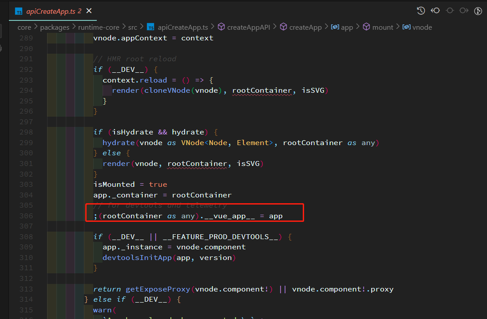
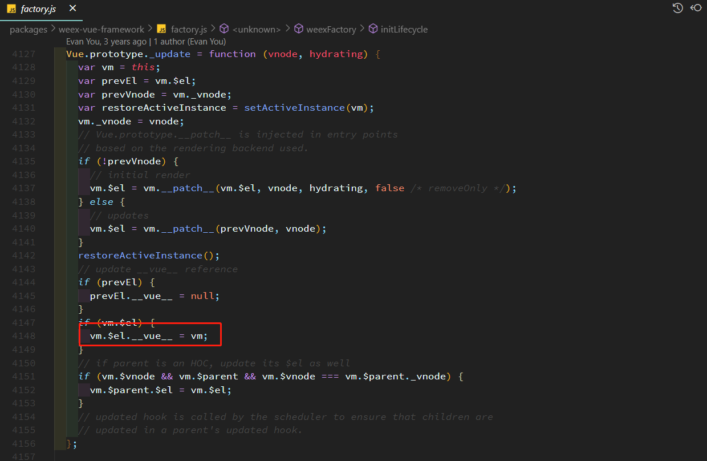
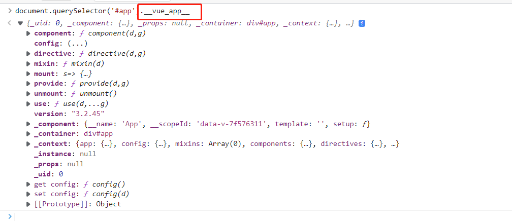
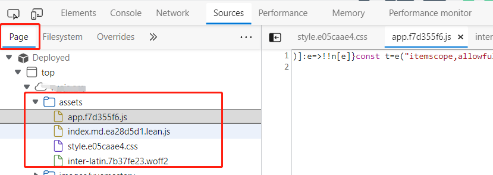
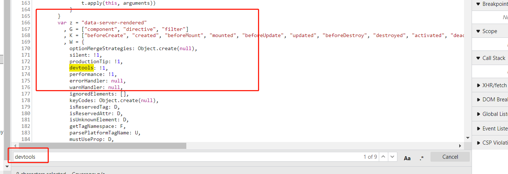
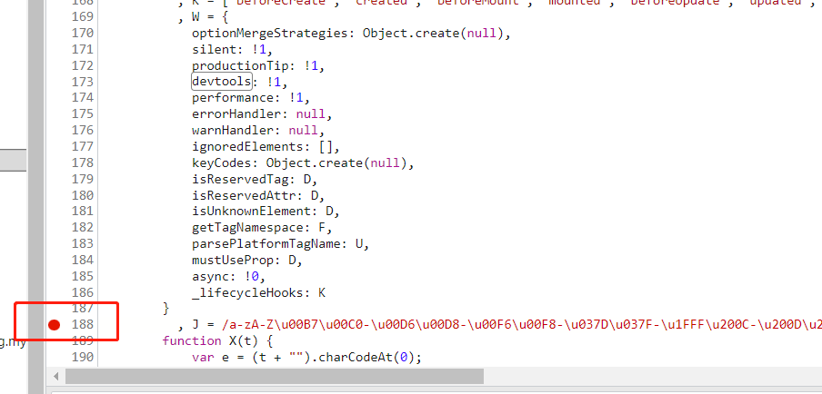
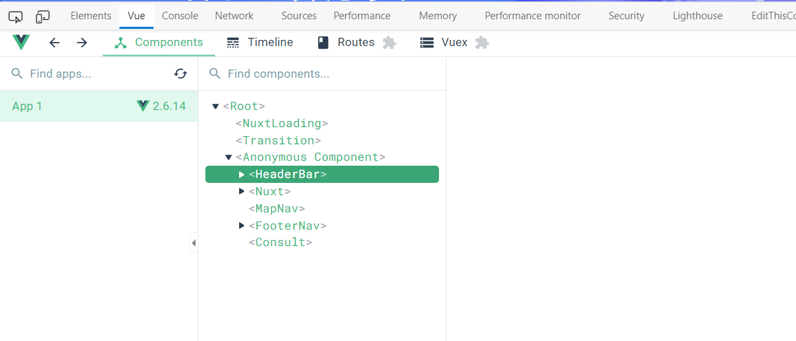
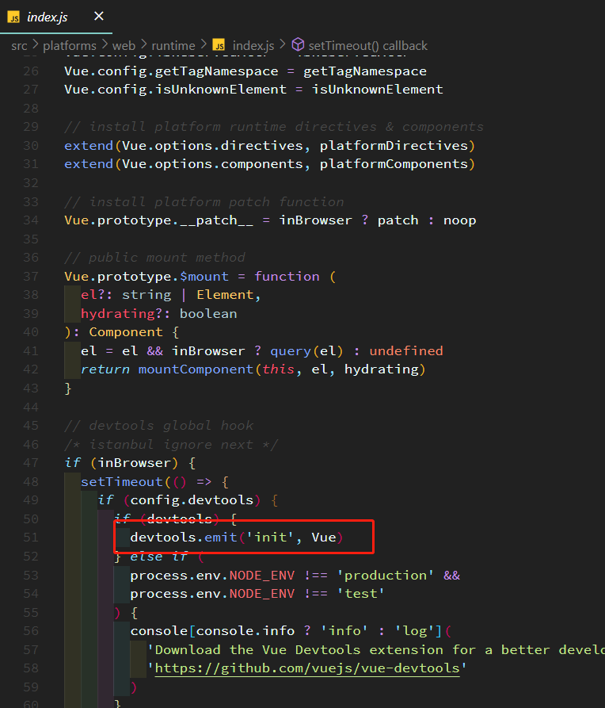

+++
title = "如何在生产环境排查 Vue 应用问题"
date = "2022-09-08"
author = "naeco"
[taxonomies]
tags = ["vue"]
+++

### 前言

很多时候，我们没有完整的测试环境，或者不能在测试环境复现问题，因此不得不在生产环境上面排查问题。在生产环境上，我们可供使用的工具就显得捉襟见肘了，除了打开网页控制台，看一下network、elements之外，我们还能做些什么呢？没关系，今天就跟随本文学习几种方法（主要针对Vue应用）。


### vue实例

很多人不知道，vue 会在挂载的 DOM 节点上设置一个属性，指向对应的 vue 实例。

我们可以查看相关的源代码：



> vue 2.x



**所以我们可以这样获取实例**




我们可以通过 `__vue_app__` 这个字段获取到 vue 实例，这样子我们就可以获取到组件的状态，查看是否有和预期不一致的现象，从而发现问题。 `__vue_app__`是 vue 3.x 版本设置的，针对 2.x 版本，我们可以使用 `__vue__`。


### vue-devtools

`vue-devtools `  是 vue 官方提供的一个浏览器插件，帮助我们调试 vue 应用，通过这个插件，我们观察应用的结构、状态、事件等等。但是默认情况下，这个插件只会在本地开发环境开启，部署到线上就不能使用了。

我们可以通过一些设定，让devtools在线上的环境也能使用，例如：

```javascript
// vite.config.js

// https://vitejs.dev/config/
export default defineConfig({
  plugins: [vue()],
  define: {
    // 开启 vue-devtools
    '__VUE_PROD_DEVTOOLS__': true
  }
})

```

使用其它构建工具也可以修改，请查看具体[文档](https://github.com/vuejs/core/tree/main/packages/vue#bundler-build-feature-flags)

如果是 vue 2.x 版本，不用修改构建配置，直接在 `main.js` 中添加一句代码即可：

```javascript
app.config.devtools = true;
```

修改完配置后，重新构建代码，部署到线上环境，就可以正常使用 `vue-devtools` 了。

#### 无法重新构建

还有一种极端的情况，我们**无法重新部署生产环境**，因此修改配置，重新构建、部署这一条路走不通。那么这种情况，我们应该怎么处理呢？

vue 2.x 版本的比较容易解决，因为这个版本 devtools 工具是通过运行时的配置来开启的，我们可以在生产环境通过调试工具修改配置。具体操作步骤：

1. 打开网页控制台 - source，找到网站对应的静态资源，这里的 js 文件可能会很多，我们需要找到 vue 对应的源文件。

   



2. 点击源文件，格式化

   

3. 筛选出 devtools 配置，找到对应的代码片段

   

5. 打一个断点

   

6. 然后刷新浏览器，此时会在断点这里暂停

   


7. 在代码执行暂停期间，我们在 Console 手动修改配置，执行以下的代码

   

8. 最后恢复断点，关闭控制台，再重新打开，就可以看到 `vue-devtools` 正常启用了

   

这种方法有个缺点，每次刷新或者重新进入网页，都会重置状态，又要重新走一遍步骤。针对这个问题，**我们可以使用网页代理工具，比如 [Fiddler](https://www.telerik.com/fiddler) 和 [Charles](https://www.charlesproxy.com/) 等，配置规则，拦截网页、修改 JS 内容**。

有没有更加简单的方式呢？其实有的，阅读源码后我们可以发现 vue 开启 devtools的关键代码：



因此我们也可以用这种方式开启 devtools

```javascript
(function () {
  // 随便获取一个 vue 组件
  let app;
  const all = document.querySelectorAll("*");
  for (let i = 0; i < all.length; i++) {
    if (all[i].__vue__) {
      app = all[i].__vue__;
      break;
    }
  }

  if (!app) return false;

  // 获取 Vue 基类
  let Vue = Object.getPrototypeOf(app).constructor;
  while (Vue.super) {
    Vue = Vue.super;
  }

  // 参考源码，手动开启 devtools
  const devtools = window.__VUE_DEVTOOLS_GLOBAL_HOOK__;
  Vue.config.devtools = true;
  devtools.emit("init", Vue);
  return true;
})();
```

拷贝上面的代码到控制台执行，然后关闭控制台重新打开，就可以开启 `vue-devtools` 了。

因为 3.x 版本将 devtools 改为编译的配置了，又因为 tree-shaking 的作用， `vue-devtools` 相关的代码都被清理掉了，所以我们不能用同样的方式开启调试工具，就算可以开启，大部分功能也是不能正常使用的。

**社区上也有人基于同样的机制，制作了一个 [浏览器插件](https://chrome.google.com/webstore/detail/oohfffedbkbjnbpbbedapppafmlnccmb/reviews)，使用这个插件，不用这些繁琐的操作，直接在生产环境上开启 `vue-devtools`。**


