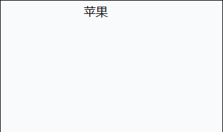
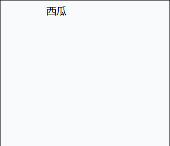
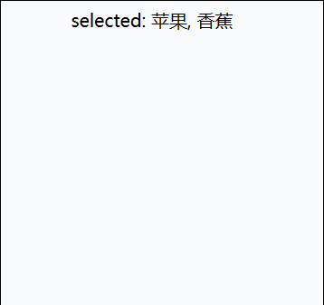
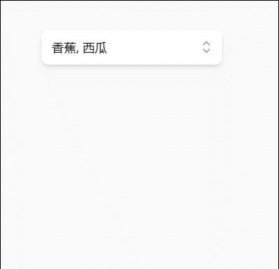

+++
title = "headless UI 的哲学"
date = "2022-12-31"
author = "naeco"
[taxonomies]
tags = ["javascript", "vue"]
+++

### 什么是 headless UI

headless 直译过来就是无头的，比方说 headless browser，指的是无头浏览器。无头浏览器也是浏览器，不过缺少了图形界面，通常用编程来控制这种浏览器，用于测试等任务。headless UI 也是差不多的意思，指的就是**不提供样式的 UI 组件**。相对于传统的 UI 组件，比方说 antd、element-ui 等的传统组件库，headless UI 组件只处理状态变更、事件绑定、浏览器兼容性和无障碍访问等功能，唯独就是缺少了样式。

我们来看一些简单的例子，一般的 UI 组件库，我们一般这样使用组件：

```typescript
<script setup lang="ts">
import { ref } from 'vue'

const enabled = ref(false)
</script>

<template>
  <el-switch v-model="enabled"></el-switch>
</template>
```

当使用 headless UI 组件时，我们需要这样写代码：

> 本文使用了 TailwindCSS 作为样式解决方案

```typescript
<script setup lang="ts">
import { ref } from 'vue'
import { Switch } from '@headlessui/vue'

const enabled = ref(false)
</script>

<template>
  <div class="py-16">
    <Switch v-model="enabled" :class="enabled ? 'bg-teal-900' : 'bg-teal-700'"
      class="relative inline-flex h-[38px] w-[74px] shrink-0 cursor-pointer rounded-full border-2 border-transparent transition-colors duration-200 ease-in-out focus:outline-none focus-visible:ring-2 focus-visible:ring-white focus-visible:ring-opacity-75">
      <span class="sr-only">Use setting</span>
      <span aria-hidden="true" :class="enabled ? 'translate-x-9' : 'translate-x-0'"
        class="pointer-events-none inline-block h-[34px] w-[34px] transform rounded-full bg-white shadow-lg ring-0 transition duration-200 ease-in-out" />
    </Switch>
  </div>
</template>
```

很明显可以看出区别了，headless UI 组件需要我们自己处理样式。

> 一般情况下，我们也不会直接使用 Headless UI 组件，会包装一层样式再使用

### 为什么要用 headless UI

相较于传统的组件，headless UI 组件还需要进一步地封装，稍嫌麻烦。那为什么我们要使用它呢？这里我们可以从传统地组件库开始分析，一般的组件库虽然方便，开箱即用，但是在真实业务场景中灵活性远远不足，体现在：

1. 每个公司可能都有自己的设计系统，组件库基本上只能做一些主题色的定制，更深层次的定制就捉襟见肘了，所以与公司设计系统不一致，造成体验上的割裂感
2. 不同的业务场景有不同的需求，通用的组件库是无法胜任灵活的业务系统。而且做定制化需要对组件库内部细节有一定的了解，代码会严重耦合，难于维护和扩展。关于这点，相信做过表单和表格组件定制化的同学记忆深刻...

headless UI 的出现解决了这两个问题，你不是要定制样式吗，现在我连样式都不提供，全部由你自己来实现，想怎么折腾就怎么折腾，无论多离谱的定制化都能实现。headless UI 核心是逻辑和样式分离，只提供最核心的逻辑，当你觉得功能不够丰富，不能满足业务需求时，你可以在 headless UI 组件的基础上自由发挥，组合不同的技术，实现你想要的效果。在 headless UI 组件的基础上，你可以使用各种样式解决方案：TailwindCSS、CSS modules、CSS in JS ... ；各种的状态存储方案：响应式数据、不可变数据 ...

举一个很简单的例子，我们有一个表格组件，由于数据量太大，我们要在表格上实现虚拟滚动的效果。对于传统的组件，这几乎是不可能实现的需求，因为渲染逻辑是表格内部控制的，业务层是无法控制的。就算能实现，也会影响到其它功能，比如勾选、筛选、分列等等。如果使用 headless UI 来实现，业务层可以完全控制渲染逻辑，不需要修改表格内部的逻辑，只需要在此基础上再套上一个 headless 虚拟滚动组件。

伪代码如下：

```typescript
<script setup lang="ts">
import { ref } from 'vue'

// 全部表格数据
const list = ref([
    {
        id: 1,
        name: 'foo'
    },
    {
        id: 2,
        name: 'bar'
    }
]);
// 当前要渲染的数据
const renderList = ref([]);

// 更新渲染数据
const onScroll = (data) => {
    renderList.value = data;
};
</script>

<template>
  <headless-table :data="list">
 	<div class="scroll-container">
        <headless-vitrual-scroll height="20" size="20" :data="list" @change="onScroll">
            <div v-for="item in renderList" :key="item.id">
            	// 渲染每一行...
            </div>
        </headless-vitrual-scroll>
    </div>
  </headless-table>
</template>
```

### headless UI 实践

接下来，我们做一些实践，基于 headless UI 组件实现一个完善的 Select 组件

基本的代码：

```typescript
<script setup lang="ts">
import { ref } from 'vue'
import {
  Listbox,
  ListboxButton,
  ListboxOptions,
  ListboxOption,
} from '@headlessui/vue'

const fruits = [
  { id: 1, name: '苹果' },
  { id: 2, name: '香蕉' },
  { id: 3, name: '草莓' },
  { id: 4, name: '西瓜' },
  { id: 5, name: '橘子' },
]
const selectedFruit = ref(fruits[0])
</script>

<template>
  <Listbox v-model="selectedFruit">
    <ListboxButton>{{ selectedFruit.name }}</ListboxButton>
    <ListboxOptions>
      <ListboxOption v-for="fruit in fruits" :key="fruit.id" :value="fruit">
        {{ fruit.name }}
      </ListboxOption>
    </ListboxOptions>
  </Listbox>
</template>
```

代码很简单，就是渲染选中的值和选项，没有任何 UI，效果如下：



加一点样式：

```typescript
<template>
  <Listbox v-model="selectedFruit">
    <ListboxButton>{{ selectedFruit.name }}</ListboxButton>
    <ListboxOptions class="w-32 border border-solid border-zinc-400">
      <ListboxOption v-slot="{ active, selected }" v-for="fruit in fruits" :key="fruit.id" :value="person">
        <li :class="[
          active ? 'bg-amber-100 text-amber-900' : 'text-gray-900',
          'relative cursor-default select-none py-2 pl-10 pr-4',
        ]">
          <span :class="[
            selected ? 'font-medium' : 'font-normal',
            'block truncate cursor-pointer',
          ]">{{ fruit.name }}</span>
        </li>
      </ListboxOption>
    </ListboxOptions>
  </Listbox>
</template>
```



加上多选和禁用选项的功能：

```typescript
<script>
...

const fruits = [
  { id: 1, name: '苹果', disabled: false, },
  { id: 2, name: '香蕉', disabled: false, },
  { id: 3, name: '草莓', disabled: true, },
  { id: 4, name: '西瓜', disabled: false, },
  { id: 5, name: '橘子', disabled: true, },
]
const selectedFruits = ref([fruits[0], fruits[1]]);
</scripts>

<template>
  <Listbox multiple v-model="selectedFruits">
    <ListboxButton>
      selected: {{ selectedFruits.map(fruit => fruit.name).join(', ') }}
    </ListboxButton>
    <ListboxOptions class="w-32 border border-solid border-zinc-400">
      <ListboxOption v-slot="{ active, selected }" v-for="fruit in fruits" :key="fruit.id" :value="fruit"
        :disabled="fruit.disabled">
        <li :class="[
          active ? 'bg-amber-100 text-amber-900' : 'text-gray-900',
          'relative cursor-default select-none py-2 pl-10 pr-4',
        ]">
          <span :class="[
            selected ? 'font-medium text-red-500' : 'font-normal',
            fruit.disabled ? 'opacity-30 cursor-not-allowed' : 'cursor-pointer',
            'block truncate',
          ]">{{ fruit.name }}</span>
        </li>
      </ListboxOption>
    </ListboxOptions>
  </Listbox>
</template>
```



最后完善一下样式，一个基本的 Select 组件就诞生了：

```typescript
<script setup lang="ts">
import { ref } from 'vue'
import {
  Listbox,
  ListboxButton,
  ListboxOptions,
  ListboxOption,
} from '@headlessui/vue'
import { CheckIcon, ChevronUpDownIcon } from '@heroicons/vue/20/solid'

interface Fruit {
  id: number;
  name: string;
  disabled: boolean;
}
const fruits: Fruit[] = [
  { id: 1, name: '苹果', disabled: false, },
  { id: 2, name: '香蕉', disabled: false, },
  { id: 3, name: '草莓', disabled: true, },
  { id: 4, name: '西瓜', disabled: false, },
  { id: 5, name: '橘子', disabled: false, },
]

const selectedFruits = ref<Fruit[]>([]);
</script>

<template>
  <div class="fixed top-16 w-72 pl-20">
    <Listbox multiple v-model="selectedFruits">
      <div class="relative mt-1">
        <ListboxButton
          class="relative w-full cursor-default rounded-lg bg-white h-10 py-2 pl-3 pr-10 text-left shadow-md focus:outline-none focus-visible:border-indigo-500 focus-visible:ring-2 focus-visible:ring-white focus-visible:ring-opacity-75 focus-visible:ring-offset-2 focus-visible:ring-offset-orange-300 sm:text-sm"
        >
          <span class="block truncate">{{ selectedFruits.map(fruit => fruit.name).join(', ') }}</span>
          <span class="pointer-events-none absolute inset-y-0 right-0 flex items-center pr-2">
            <ChevronUpDownIcon class="h-5 w-5 text-gray-400" aria-hidden="true" />
          </span>
        </ListboxButton>

        <transition
          leave-active-class="transition duration-100 ease-in"
          leave-from-class="opacity-100"
          leave-to-class="opacity-0"
        >
          <ListboxOptions
            class="absolute mt-1 max-h-60 w-full overflow-auto rounded-md bg-white py-1 text-base shadow-lg ring-1 ring-black ring-opacity-5 focus:outline-none sm:text-sm"
          >
            <ListboxOption
              v-slot="{ active, selected }"
              v-for="fruit in fruits"
              :key="fruit.id"
              :value="fruit"
              :disabled="fruit.disabled"
              as="template"
            >
              <li
                :class="[
                  active ? 'bg-amber-100 text-amber-900' : 'text-gray-900',
                  'relative cursor-default select-none py-2 pl-10 pr-4',
                ]"
              >
                <span
                  :class="[
                    selected ? 'font-medium' : 'font-normal',
                    fruit.disabled ? 'opacity-30 cursor-not-allowed' : 'cursor-pointer',
                    'block truncate',
                  ]"
                >
                  {{ fruit.name }}
                </span>
                <span v-if="selected" class="absolute inset-y-0 left-0 flex items-center pl-3 text-amber-600">
                  <CheckIcon class="h-5 w-5" aria-hidden="true" />
                </span>
              </li>
            </ListboxOption>
          </ListboxOptions>
        </transition>
      </div>
    </Listbox>
  </div>
</template>
```

> 录制出来的 GIF 图片显示有一点问题



### 总结

本文介绍了 headless UI 的一些概念，从传统 UI 库的痛点出发，介绍了 headless UI 的优势，如何解决这些痛点。最后，基于实际的业务场景，学习了如何使用 headless UI 组件。

软件工程没有银弹，headless UI 的解决一部分问题的同时，也会引入新的问题，比如，提高了编码的复杂性。headless UI 组件并不像一般的组件那样开箱即用，需要开发者做大量的封装，才能真正在业务上使用，对于开发者的能力有较高的要求。
