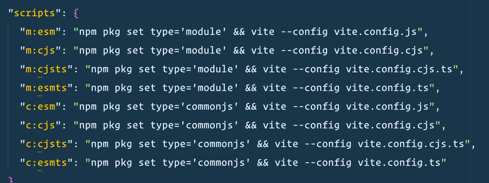

+++
title = "Node.js 中使用 ESM 模块"
date = "2024-03-10"
author = "naeco"
[taxonomies]
tags = ["nodejs"]
+++

## 为什么不使用 CommonJS

1. 不是标准，只适用于 Node.js。不能在浏览器、Deno 等 runtime 上运行（需要编译或者中间层适配）

2. CommonJS 语法太灵活，一些信息只能在运行时获取。因此没有办法进行静态分析，也没办法 tree-shaking，无法裁剪优化代码。

CommonJS 太灵活，只能在运行时获取信息...

```javascript
const exportKey = localStorage.getItem(Math.random());
module.exports[exportKey] = () => {
  ...
};
```

3. 同时使用多种模块化标准，不利于分发代码。

比如，一个 NPM 模块需要支持两种标准，需要引入额外的构建步骤，而且构建过程很复杂...



## 在 Node.js 中使用 ESM

> Node.js 从 12.x 版本开始支持 ESM。当前低于 <= 12.x 的版本，执行时候需要声明 `--experimental-modules` flag：
>
> ```bash
> node --experimental-modules index.mjs
> ```

### 基本使用

最简单的方法，将 `.js` 文件后缀改为 `.mjs`，同时加上后缀名

```javascript
// mod.mjs
export const add = (a, b) => {
  return a + b;
};
```

```javascript
// index.mjs
import { add } from "./mod.mjs";
console.log(add(1, 1));
```

```bash
node index.mjs
// 2
```

如果不想改为`.mjs`后缀，可以在 package.json 设置 `type` 字段为 `module`，这样 Node.js 才能识别到使用的是 ESM 模块

```json
{
  ...
  "type": "module"
}
```

### 加载内置模块

加载 Node.js 内置模块需要加上 `node:` 前缀：

```javascript
import EventEmitter from "node:events";
const e = new EventEmitter();
```

```javascript
import { readFile } from "node:fs";
readFile("./foo.txt", (err, source) => {
  if (err) {
    console.error(err);
  } else {
    console.log(source);
  }
});
```

### 动态导入

动态导入同样也是支持的：

```javascript
import { readFile } from "node:fs";
import("node:fs").then((fs) => {
  fs.readFile("./foo.txt", (err, source) => {
    if (err) {
      console.error(err);
    } else {
      console.log(source);
    }
  });
});
```

### 加载 NPM 模块

与此同时，依然可以使用 NPM 的模块，不管是否提供 ESM 模块包，因为 Node.js 支持在 ESM 模块中导入 CommonJS 模块

```javascript
// cjs.cjs
exports.name = "exported";
```

```javascript
import { name } from "./cjs.cjs";
console.log(name);
//  'exported'

import cjs from "./cjs.cjs";
console.log(cjs);
//  { name: 'exported' }

import * as m from "./cjs.cjs";
console.log(m);
// [Module] { default: { name: 'exported' }, name: 'exported' }
```

### 加载网络模块

> 需要 Node.js 版本 >= 20.x，并声明 `--experimental-network-imports` flag

Nodejs 可以在 ESM 模块中加载网络模块，实现类似 Deno 的依赖管理机制：

```javascript
import worker_threads from "node:worker_threads";
import { configure, resize } from "https://example.com/imagelib.mjs";
configure({ worker_threads });
```

## 总结

可以说 CommonJS 已经完成了它的历史使命，我们应该拥抱新的标准格式 ESM。本文总结了 CommonJS 相对于 ESM 的缺点，并提供了如何在 Node.js 中使用 ESM 的示例。

## 相关文章

- [CommonJS is hurting JavaScript](https://deno.com/blog/commonjs-is-hurting-javascript)
- [How CommonJS is making your bundles larger ](https://web.dev/articles/commonjs-larger-bundles#tree-shaking_with_commonjs)
- [Node.js ESM Docs](https://nodejs.org/docs/latest-v20.x/api/esm.html#modules-ecmascript-modules)
- [Node.js Determining module system](https://nodejs.org/docs/latest-v20.x/api/packages.html#determining-module-system)
- [esm.sh](https://esm.sh/#docs)
