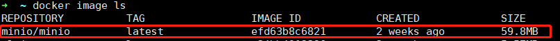
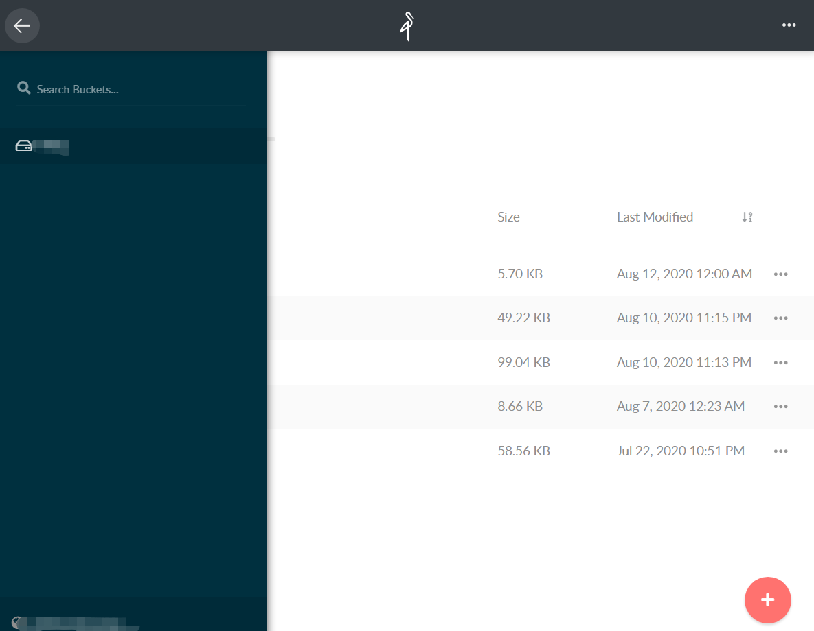
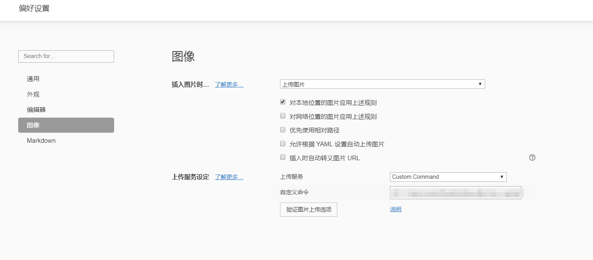

+++
title = "利用Minio搭建私有图床"
date = "2020-08-11"
author = "naeco"
[taxonomies]
tags = ["minio", "blog"]
+++

### 前言

​	图片存储服务，也叫图床，是每个博客都需要具备的基础服务，因为图片是一种比文字更加生动、具象和容易理解的信息媒介。纯文本的文章会相当枯燥，图片可以更好的帮助我们理解和阅读。过往我们采用的是公共免费的图床，比如SM.MS、微博图床和七牛云图床等服务，但是这些服务缺点很多，首先存储容量受限，其次是稳定性，我们不能保证这些服务可以一直提供（一般企业为了节省带宽费用，会对图片做防盗链处理），最重要的是图片安全性的欠缺，毕竟放在别人家里，很难保证别人会帮你好好保存。

​	基于上述原因，自建私有图床逐渐成为了大家的首选项，下面就给大家介绍一下如何搭建一个图床，存储服务选用的是[Minio](https://min.io/)。Minio是GlusterFS创始人之一Anand Babu Periasamy发布的开源项目，兼容Amason的S3分布式对象存储项目，采用`Golang`实现，客户端支持`Java`,`Python`,`Javacript`, `Golang`语言。`Minio`可以做为云存储的解决方案用来保存海量的图片，视频，文档。由于采用`Golang`实现，服务端可以工作在Windows,Linux, OS X和FreeBSD上。配置简单，基本是复制可执行程序，单行命令可以运行起来。

### 部署Minio服务

​	`Minio`官方提供了docker的部署方式，一条命令就可以将服务部署起来，首先我们需要下载`Minio`的官方镜像。



然后，根据[教程](https://docs.min.io/docs/minio-docker-quickstart-guide)执行命令，可以参考本人的命令：

```bash
docker run -itd -p 9000:9000 \
  --name minio1 \
  -v /mnt/minio/data:/data \
  -v /mnt/minio/config:/root/.minio \
  -e "MINIO_ACCESS_KEY=你的accessKey" \
  -e "MINIO_SECRET_KEY=你的secretKey" \
  minio/minio server /data
```

其中`/mnt/minio/data`和`/mnt/minio/config`是你的数据挂载目录和配置文件所在目录，这个根据自己需求设置就可以了。命令执行成功后，打开浏览器，输入`localhost:9999`就可以访问到`Minio`的管理后台，输入`accessKey`和`secretKey`即可进入。




### 配置Nginx

​	如果需要外网访问`Minio`的后台，我们需要配置Nginx，建议申请一个域名，然后在域名控制台配置二级域名，然后再`nginx.conf`下面配置:

```
server {
    listen 80;
    # 这里填写你的二级域名
    server_name xxx.xxx.xxx;

    location / {
        proxy_pass http://127.0.0.1:9000;
        proxy_set_header Host $host;
        proxy_set_header X-Real-IP $remote_addr;
    }
}
```

同时，图片访问也需要进行配置:

```
 server{
    listen 80;
    # 这里填写你的图片访问域名
    # 比如你的图片地址是 http://image.user.com/blog/demo.png
    # 那么下面就填写image.user.com, blog是bucket名称
    server_name xxx.xxx.xxx;
    location / {
        root /mnt/minio/data/;
    }
}
```

最后，你就可以在公网上用域名访问你的图片了，记得二级域名后面带上图片所在的`bucket`名称。

### Typora粘贴上传

​	聪明的你很可能想到了，每次写博客的时候，都要登录`Minio`后台上传图片，然后复制URL到博文里面，过程有点繁琐，那么能不能简化呢？方法是有点，最普遍的是采用图床客户端，比如`PicGo`和`uPic`等工具，但是这些工具有的只支持Mac系统，有的不支持`Minio`，需要额外编写插件，所以还是很麻烦。于是聪明的我又想到了一个简单的方法，刚好[Typora](https://www.typora.io/)完美支持，`Typora`是一个`MarkDown`编辑器，如果有不了解的，强烈推荐去下载一个试试。`Typora`支持图片自定义上传，插入图片的时候，可以配置相应的脚本。所以我们可以写一个上传的脚本，每当图片插入时，就运行脚本，将图片上传到我们的图床，最后返回图片的公网地址，更新`MarkDown`内容，首先我们要配置`Typora`, 打开文件->偏好设置->图像，可以看到有个上传服务设定的选项。



我们将上传服务切换到`Custom Command`，也就是自定义命令了，然后在自定义命令输入你的命令，比如`node upload.js`，`Typora`会在上传图片时执行这个命令，图片路径将会作为参数传递给脚本。

​		脚本写起来也非常简单，下面贴出本人的图片上传脚本:

```javascript
/* 
 * typora插入图片调用此脚本，上传图片到图床
 */

const path = require('path')
// minio for node.js
const Minio = require('minio') 
const { promises } = require('fs')

// 解析参数， 获取图片的路径，有可能是多张图片
const parseArgv = () => {
  const imageList = process.argv.slice(2).map(u => path.resolve(u))
  return imageList
}

// 入口
const uploadImageFile = async (imageList = []) => {
  // 创建连接
  const minioClient = new Minio.Client({
    // 这里填写你的minio后台域名
    endPoint: 'xxx.xxx.xxx',
    port: 80,
    useSSL: false,
    // 下面填写你的accessKey和secretKey
    accessKey: '*************',
    secretKey: '*************'
  })

  // 开始上传图片
  const metaData = {}
  const tasks = imageList.map(image => {
    return new Promise(async (resolve, reject) => {
      try {
        // 图片重命名，这里采用最简单的，可以根据自己需求重新实现
        const name = `${Date.now()}${path.extname(image)}`
        // 具体请看Minio的API文档，这里是将图片上传到blog这个bucket上
        const res = await minioClient.fPutObject('blog', name, image, metaData)
        resolve(name)
      } catch (err) {
        reject(err)
      }
    })
  })

  const result = await Promise.all(tasks)
  
  // 返回图片的访问链接
  result.forEach(name => {
    const url = `http://xxx.xxx.xxx/blog/${name}`
    // Typora会提取脚本的输出作为地址，将markdown上图片链接替换掉
    console.log(url)
  })
}

// 执行脚本
uploadImageFile(parseArgv())
```

### 后续

​	最终，我们部署了一个安全可靠的图床服务，并实现了`Typora`的粘贴自动上传功能，整个过程不会很复杂，相信只有认真看完，十几分钟就能走完流程，期待你能亲自动手实践！