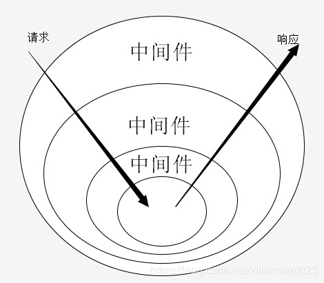

+++
title = "koa原理解析"
date = "2020-08-14"
author = "naeco"
[taxonomies]
tags = ["koa", "nodejs", "javascript"]
+++

> 基于koa 2.x版本

### koa是什么

​	[koa](https://koa.bootcss.com/#)是[express](https://expressjs.com/)幕后原班人马打造的新一代Web框架，旨在成为Web应用和API开发一个精细、健壮和优雅的基础框架。相对于express来说，koa更加轻量化，路由、模板引擎等的开箱即用的特性都不再支持。我们也可以更直接的说，koa是一个简单的中间件框架，基于此可以编写服务端应用程序，也可以作为其他服务端框架的基础，例如社区知名的框架[eggjs](https://eggjs.org/zh-cn/)就是基于koa开发的。

​	我们可以看一个koa使用的范例：

```javascript
const Koa = require('koa');
const app = new Koa();

app.use(async (ctx, next) => {
  ctx.body = 'Hello World';
});

app.listen(3000);
```


### koa源码解析

​	koa的代码结构非常简单，核心代码只有4个文件，总共的代码加起来2000行左右，核心代码不超过500行，如果大家想更加了解koa，十分推荐阅读源码，我们首先来看一下koa项目主要的文件结构：

```bash
.
├── benchmarks # 压力测试脚本
├── docs # 文档
├── History.md # 更改历史     
├── lib # 核心源码
├── LICENSE # 协议说明
├── package.json      
├── Readme.md
└── test # 测试脚本
```

lib文件夹下包含了核心的4个文件：

```shell
.
├── application.js # 项目入口，最终导出给用户使用
├── context.js     # 请求上下文相关
├── request.js     # http request相关
└── response.js    # http response相关
```

下面我们会讲解主要的功能模块，包括application.js和context.js，另外两个文件不涉及太多逻辑，只做简单的介绍。application.js文件包含了koa的主要逻辑，里面包含了koa初始化，以及listen和use等函数的实现，我们用上面的使用实例来讲解这些模块，首先是koa的初始化：

```javascript
// demo
const app = new Koa();

// application.js
constructor(options) {
    // koa对象集成了nodejs的events，可以使用发布订阅模型
    super();
 	// 配置项处理
    options = options || {};
    this.proxy = options.proxy || false;
    this.subdomainOffset = options.subdomainOffset || 2;
    this.proxyIpHeader = options.proxyIpHeader || 'X-Forwarded-For';
    this.maxIpsCount = options.maxIpsCount || 0;
    this.env = options.env || process.env.NODE_ENV || 'development';
    if (options.keys) this.keys = options.keys;
    // 存储中间件的数组
    this.middleware = [];
    // context的原型，具体实现位于context.js
    this.context = Object.create(context);
    // request的原型，具体实现位于request.js
    this.request = Object.create(request);
    // response的原型，具体实现位于response.js
    this.response = Object.create(response);
   	
    ...
}
```

然后是use函数，这个函数的功能是挂载中间件。

```javascript
// demo
app.use(async (ctx, next) => {
  ctx.body = 'Hello World';
});

// application.js
use(fn) {
    // 参数必须是函数类型，否则抛出错误
    if (typeof fn !== 'function') throw new TypeError('middleware must be a function!');
    // koa2.x以下的版本，中间件采用的是迭代器函数而不是async函数
    // 这段代码是将迭代器函数转化为async函数，具体实现可以看koa-convert，此处不做赘述
    if (isGeneratorFunction(fn)) {
      deprecate('Support for generators will be removed in v3. ' +
                'See the documentation for examples of how to convert old middleware ' +
                'https://github.com/koajs/koa/blob/master/docs/migration.md');
      fn = convert(fn);
    }
    // 将中间件推入数组中存储
    this.middleware.push(fn);
    // 返回app对象，方便链式调用
    return this;
}
```

最后就到了启动服务的流程了：

```javascript
// demo
app.listen(3000);

// application.js
// 可以看到koa的listen函数其实是一个语法糖，关键的逻辑再callback函数里面
listen(...args) {
    const server = http.createServer(this.callback());
    return server.listen(...args);
}

... 

// callback函数实现，这里由两个关键的地方
// 一个是createContext函数，另一个是handleReeust函数
callback() {
    // 组装中间件，这里逻辑在koa-compose这个包里面，后面会详细解析
    const fn = compose(this.middleware);

    // 声明http.createServer函数所接受的回调方法
    const handleRequest = (req, res) => {
      // 根据原始req，res创建context对象
      const ctx = this.createContext(req, res);
      // 执行koa的逻辑
      return this.handleRequest(ctx, fn);
    };
	
    // 返回这个回调
    return handleRequest;
}

...

// 创建请求上下文
// 这个方法会根据http原生的req和res对象创建出koa的context、request和response
createContext(req, res) {
    // 实例化对象
    const context = Object.create(this.context);
    const request = context.request = Object.create(this.request);
    const response = context.response = Object.create(this.response);
    // 互相引用，方便使用
    context.app = request.app = response.app = this;
    context.req = request.req = response.req = req;
    context.res = request.res = response.res = res;
    request.ctx = response.ctx = context;
    request.response = response;
    response.request = request;
    
    ...
    
    return context;
}

...

// 这里是每次请求的处理逻辑
handleRequest(ctx, fnMiddleware) {
    const res = ctx.res;
    res.statusCode = 404;
    const onerror = err => ctx.onerror(err);
    const handleResponse = () => respond(ctx);
    
    ...
    
    // 可以看出来，在koa的流程中，每次http请求都会先跑一遍中间件函数
    // 如果没有抛出错误，最后会调用handleResponse这个函数，做一些后置的处理
    // 而handleResponse函数最后调用的是respond函数
    // 这个函数主要帮助我们结束此次请求，并且根据我们对ctx.body赋值的类型做一些处理，返回结果
    // 看到这里，我们也就知道了为什么我们不主动调用res.end方法结束请求，请求跑完所有中间件也会自己结束的原因了。
    return fnMiddleware(ctx).then(handleResponse).catch(onerror);
}

```

以上就是koa主控模块application.js大概的实现了，代码非常清晰简单。下面我们讲述一下koa的核心概念，洋葱模型的实现，首先来一张经典的图：



从这个图里可以看出来，请求首先从外层中间件(首先被use的中间件)执行，一直执行到最后一个中间件（最后use的中间件），然后又从最后一个冒泡到第一个，其实和浏览器的事件冒泡模型非常像。koa的中间件接受两个参数，一个是context，代表当前请求的上下文对象，一个是next，每当调用next，中间件就会将控制权交给下一个中间件，等待返回结果，或者捕获错误。那么koa是怎么实现这一个巧妙的模型的呢？一切答案都在koa-compose这个包里面。

```javascript
// 传入中间件数组
function compose (middleware) {
  
    ...

  // 返回一个函数，参数是请求上下文和自定义next函数
  return function (context, next) {
    // 记录上次执行的中间件序号
    let index = -1
    // 从第一个中间件开始执行
    return dispatch(0)
    
    // 中间件调度函数，参数i是中间件序号
    function dispatch (i) {
      // 避免多次调用next
      if (i <= index) return Promise.reject(new Error('next() called multiple times'))
      // 更新序号
      index = i
      // 取出中间件
      let fn = middleware[i]
      // 这里如果成立，说明最后一个中间件调用next了，这里默认返回一个promise
  	  // 同时也可以根据业务需求，传入自己的next函数
      if (i === middleware.length) fn = next
      if (!fn) return Promise.resolve()
      // 执行中间件函数
      try {
        // 可以看出来next函数就是调用下一个中间件的dispatch函数
        // 这里很巧妙的通过闭包实现了koa的核心中间件模型
        return Promise.resolve(fn(context, dispatch.bind(null, i + 1)));
      } catch (err) {
        // reject promise
        return Promise.reject(err)
      }
    }
  }
}
```

​	剩下的context.js、response.js、request.js三个文件主要是封装一些方法和属性方便我们进行业务开发，比如cookie的解析和读取、http请求头、http响应头和解析http各种参数等等，在此不作探讨了，有兴趣的同学可以把代码clone下来自己慢慢研究。


### express、koa和egg

​	express和koa是由同班人马打造，两者的差别有以下这些：

1. express采用callback控制异步流程，而koa采用了新的语法标准async和await

2. 中间件模型不一致，express是简单的线性调用，koa是洋葱模型

3. express旨在提供一个完善的后端应用开发解决方案，内置组件包含路由、视图引擎和http内容解析等。而koa的目标是提供一个轻量化的解决方案，很多特性都不再内置，开发一个完整的应用，还需要安装其他模块。

​	至于egg，则是对于koa更高一层的封装了，由于koa的设计理念，导致了基于koa的开发模式非常多，社区也没有统一的风格，这种现象不利于企业开发产品。同时，koa实在是太轻量了，很多必须的特性都没有，虽然说koa社区也很强大，但是要开发者处理这些，也需要耗费很大的精力。egg基于koa这个底层框架，重新打造了一套完善的开发框架，支持许多功能，比如定时器、路由、多环境配置、测试和部署等等。更重要的是，egg强制规范了开发风格和代码结构，推行约定大约配置的理念，非常适合企业团队开发。