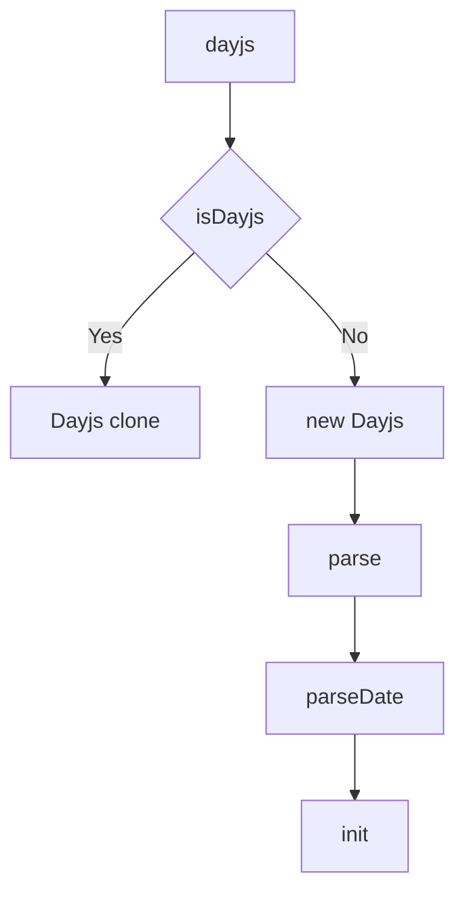
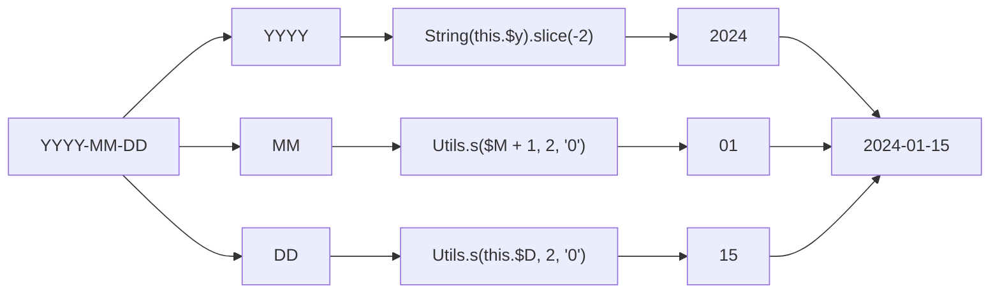
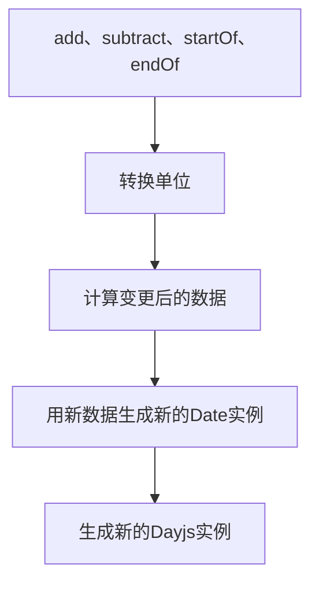

+++
title = "dayjs 分析"
date = "2024-01-15"
author = "naeco"
[taxonomies]
tags = ["javascript"]
+++

## dayjs 介绍

[dayjs](https://dayjs.gitee.io/zh-CN/) 是一个热门的时间日期库，npm 每周下载量超过千万。

dayjs 的卖点是：

1. 代码体积小；打包后仅 2kb
2. 简单；API 和 Moment.js 保持一致
3. 不可变数据；每次操作都会返回新的对象，避免 bug 产生，方便调试
4. 国家化支持良好；

工作中时常使用 dayjs，十分好奇其中的实现细节，趁着有时间，赶紧做一期源码分析，here we go！

## dayjs debug

要调试 dayjs 代码，首先要在 github 上把代码拉取下来。

然后安装依赖，构建代码

```bash
npm install
npm run build
```

用 vscode 打开，创建一个 js 文件和调试配置

```bash
touch debug.js .vscode/launch.json
```

```javascript
// debug.js
const dayjs = require("./dayjs.min");

const d1 = dayjs();
```

```json
// launch.json
{
  "version": "0.2.0",
  "configurations": [
    {
      "type": "node",
      "request": "launch",
      "name": "Launch Program",
      "skipFiles": ["<node_internals>/**"],
      "program": "${workspaceFolder}/debug.js"
    }
  ]
}
```

这样就可以调试了，但是设置断点查看 dayjs 代码，我们看到的都是混淆后的代码，不利于阅读和分析，所以我们需要 sourcemap 文件映射回原来的代码。

改一下构建的配置，配置文件在 build 目录的 rollup.config.js 文件中：

```javascript
// rollup.config.js

module.exports = (config) => {
  ...

  return {
    ...

    output: {
      ...
      // 其它代码不用修改，加上下面这一行
      sourcemap: true
  }
}
```

再构建一次：

```bash
npm run build
```

最后，就可以愉快地进行调试了。

## dayjs 分析

### 解析

调用 dayjs 时，支持用多种类型初始化

```javascript
// 不传参数，表示当前时间
dayjs();

// 使用 ISO 8601 格式的字符串
dayjs("2018-04-13 19:18:17.040+02:00");
// 使用字符串 + 格式 (依赖 CustomParseFormat 插件)
dayjs("12-25-1995", "MM-DD-YYYY");

// 使用时间戳
dayjs(1318781876406);

// JS Date对象
dayjs(new Date(2024, 1, 15));
```

我们来分析一下 dayjs 这个方法：

```javascript
const dayjs = function (date, c) {
  // 首先判断是否为Dayjs实例，如果是，直接返回一份克隆（深拷贝）
  if (isDayjs(date)) {
    return date.clone();
  }
  // 参数统一化
  const cfg = typeof c === "object" ? c : {};
  cfg.date = date;
  cfg.args = arguments;
  // 返回dayjs的实例
  return newdayjs(cfg);
};
```

dayjs 方法的逻辑比较简单，规范了输入参数，返回一份 Dayjs 实例。这里要强调一下，要区分开 dayjs 和 Dayjs：

1.dayjs 是对外暴露的调用入口，用于生成 Dayjs 实例，除此之外，dayjs 上也挂载了一系列辅助方法。
2.Dayjs 才是真正的日期时间对象，对日期时间的各种操作都是基于 Dayjs 的实例。

我们来分析 Dayjs 对象（由于代码比较长，采取分段分析，并省略一部分代码）：

```javascript
class Dayjs{
  constructor(cfg) {
    // 解析地区
    this.$L = parseLocale(cfg.locale, null, true)
    // 开始解析
    this.parse(cfg);
    this.$x = this.$x || cfg.x || {};
    // 标识这是一个Dayjs实例
    this[IS_DAYJS] = true;
  }

  parse(cfg) {
    // 解析参数，获取Date实例
    this.$d = parseDate(cfg);
    // 初始化
    this.init();
  }

  init() {
    // $d是Date是实例
    const { $d } = this;
    // 初始化年、月、日、星期、小时、分、秒、毫秒等信息
    this.$y = $d.getFullYear();
    this.$M = $d.getMonth();
    this.$D = $d.getDate();
    this.$W = $d.getDay();
    this.$H = $d.getHours();
    this.$m = $d.getMinutes();
    this.$s = $d.getSeconds();
    this.$ms = $d.getMilliseconds();
  }
  ...
}
```

可以看出，关键逻辑是 parseDate 方法，该方法将输入参数转化为 Date 实例的，我们来分析一下：

```javascript
const parseDate = (cfg) => {
  const { date } = cfg;

  // 非法参数
  if (date === null) return new Date(NaN);

  // Utils.u是判断值是否为undefined的。传入undefeind将返回当前时间
  if (Utils.u(date)) return new Date();

  // 传入Date实例
  if (date instanceof Date) return new Date(date);

  // 传入字符串
  if (typeof date === "string" && !/Z$/i.test(date)) {
    // REGEX_PARSE = /^(\d{4})[-/]?(\d{1,2})?[-/]?(\d{0,2})[Tt\s]*(\d{1,2})?:?(\d{1,2})?:?(\d{1,2})?[.:]?(\d+)?$/
    // 用上面的正则表达式，匹配特定格式的字符串
    const d = date.match(C.REGEX_PARSE);
    if (d) {
      const m = d[2] - 1 || 0;
      const ms = (d[7] || "0").substring(0, 3);
      return new Date(d[1], m, d[3] || 1, d[4] || 0, d[5] || 0, d[6] || 0, ms);
    }
  }

  return new Date(date);
};
```

parseDate 方法将解析输入的参数，生成对应的 Date 实例。因此，整体解析流程是：



### 显示

解析完成后，我们通常需要将 Dayjs 实例展示成特定的格式，最常用的就是 format 方法，这个方法根据传入的占位符返回格式化后的日期

```javascript
dayjs("2019-01-25").format("DD/MM/YYYY"); // '25/01/2019'
```

format 方法代码分析：

```javascript
class Dayjs {
  ...
  format(formatStr) {
    const locale = this.$locale()

    // 设置默认参数
    const str = formatStr || C.FORMAT_DEFAULT
    const zoneStr = Utils.z(this)
    // 初始化时得到的时间信息
    const { $H, $m, $M } = this
    // 不同的地区，周、月和上下午，定义或顺序不一样
    const {
      weekdays, months, meridiem
    } = locale

    const getShort = (arr, index, full, length) => (
      (arr && (arr[index] || arr(this, str))) || full[index].slice(0, length)
    )
    const get$H = num => (
      Utils.s($H % 12 || 12, num, '0')
    )

    const meridiemFunc = meridiem || ((hour, minute, isLowercase) => {
      const m = (hour < 12 ? 'AM' : 'PM')
      return isLowercase ? m.toLowerCase() : m
    })

    // 这个方法是format实现的关键，将会匹配占位符，替换成真实日期
    const matches = (match) => {
      switch (match) {
        // 年
        case 'YY':
          return String(this.$y).slice(-2)
        case 'YYYY':
          return Utils.s(this.$y, 4, '0')
        // 月份
        case 'M':
          return $M + 1
        case 'MM':
          return Utils.s($M + 1, 2, '0')
        case 'MMM':
          return getShort(locale.monthsShort, $M, months, 3)
        case 'MMMM':
          return getShort(months, $M)
        // 天
        case 'D':
          return this.$D
        case 'DD':
          return Utils.s(this.$D, 2, '0')
        // 星期
        case 'd':
          return String(this.$W)
        case 'dd':
          return getShort(locale.weekdaysMin, this.$W, weekdays, 2)
        case 'ddd':
          return getShort(locale.weekdaysShort, this.$W, weekdays, 3)
        case 'dddd':
          return weekdays[this.$W]
        // 小时
        case 'H':
          return String($H)
        case 'HH':
          return Utils.s($H, 2, '0')
        // 小时（12小时制）
        case 'h':
          return get$H(1)
        case 'hh':
          return get$H(2)
        // am pm
        case 'a':
          return meridiemFunc($H, $m, true)
        // AM PM
        case 'A':
          return meridiemFunc($H, $m, false)
        // 分钟
        case 'm':
          return String($m)
        case 'mm':
          return Utils.s($m, 2, '0')
        // 秒
        case 's':
          return String(this.$s)
        case 'ss':
          return Utils.s(this.$s, 2, '0')
        case 'SSS':
          return Utils.s(this.$ms, 3, '0')
        // UTC 的偏移量
        case 'Z':
          return zoneStr // 'ZZ' logic below
        default:
          break
      }
      return null
    }

    // C.REGEX_FORMAT = /\[([^\]]+)]|Y{1,4}|M{1,4}|D{1,2}|d{1,4}|H{1,2}|h{1,2}|a|A|m{1,2}|s{1,2}|Z{1,2}|SSS/g
    // 用正则匹配 formatStr，匹配项将会由matches方法处理
    return str.replace(C.REGEX_FORMAT, (match, $1) => $1 || matches(match) || zoneStr.replace(':', '')) // 'ZZ'
  }
  ...
}

```

上面的代码比较繁琐，但是逻辑比较简单，简而言之就是用一个正则表达式匹配输入的占位符，分别用数据来填充。比方说，我们这样格式化 `dayjs().format('YYYY-MM-DD')`，处理过程将是：



除了格式化字符串之外，dayjs 还支持显示 unix 时间戳

```javascript
// 毫秒
dayjs("2019-01-25").valueOf() + // 1548381600000
  dayjs(1548381600000); // 1548381600000
// 秒
dayjs("2019-01-25").unix();
```

相关代码：

```javascript
class Dayjs {
  ...

  valueOf() {
    // 直接调用date实例getTime方法，返回unix时间戳（毫秒）
    return this.$d.getTime()
  }

  unix() {
    // 返回unix时间戳（秒）
    return Math.floor(this.valueOf() / 1000)
  }
  ...
}
```

### 操作

dayjs 支持对 Dayjs 实例进行操作，修改日期

```javascript
// 增加1天
dayjs().add(1, "day");
// 先增加1天，然后减少一个月
dayjs().add(1, "day").subtract(1, "month");
// 日期设置为当月的开始
dayjs().startOf("month");
// 日期设置为当周的末尾
dayjs().endOf("week");
```

这些方法也在 Dayjs 类中：

```javascript
class Dayjs{
  ...
  // 内部方法，用于设置新数据
  $set(units, int) {
    // 这里会处理一下数据单位的缩写，比如将d转化为day，w转化为week，诸如此类
    const unit = Utils.p(units)
    // 不考虑用UTC时间的情况，this.$u === false，utcPad === ''
    const utcPad = `set${this.$u ? 'UTC' : ''}`
    // 获取数据在Date实例上的字段名
    const name = {
      [C.D]: `${utcPad}Date`,
      [C.DATE]: `${utcPad}Date`,
      [C.M]: `${utcPad}Month`,
      [C.Y]: `${utcPad}FullYear`,
      [C.H]: `${utcPad}Hours`,
      [C.MIN]: `${utcPad}Minutes`,
      [C.S]: `${utcPad}Seconds`,
      [C.MS]: `${utcPad}Milliseconds`
    }[unit]
    // 获取新数据
    const arg = unit === C.D ? this.$D + (int - this.$W) : int

    if (unit === C.M || unit === C.Y) {
      // 设置年或月
      // clone is for badMutable plugin
      const date = this.clone().set(C.DATE, 1)
      // 修改数据
      date.$d[name](arg)
      date.init()
      // 年月变更后，天数也要修改（月份总天数不一样，有30天的，有31天的，还有28、29天的）
      this.$d = date.set(C.DATE, Math.min(this.$D, date.daysInMonth())).$d
    } else if (name) {
      // 其它情况，直接操作Date实例修改数据
      this.$d[name](arg)
    }

    // 因为Date实例被修改了，所以重新初始化
    this.init()
    // 返回实例自身，方便链式操作
    return this
  }

  // 对$set方法的封装
  set(string, int) {
    // 每次操作都会返回一个新的实例，保证数据的不可变性
    return this.clone().$set(string, int)
  }

  add(number, units) {
    number = Number(number)
    const unit = Utils.p(units)
    // 修改天和周的逻辑
    const instanceFactorySet = (n) => {
      const d = dayjs(this)
      return Utils.w(d.date(d.date() + Math.round(n * number)), this)
    }
    // 设置月份
    if (unit === C.M) {
      return this.set(C.M, this.$M + number)
    }
    // 设置年份
    if (unit === C.Y) {
      return this.set(C.Y, this.$y + number)
    }
    // 设置天数
    if (unit === C.D) {
      return instanceFactorySet(1)
    }
    // 设置周数
    if (unit === C.W) {
      return instanceFactorySet(7)
    }
    // 获取对应单位的基准毫秒
    const step = {
      [C.S]: C.MILLISECONDS_A_SECOND // 1000
      [C.MIN]: C.MILLISECONDS_A_MINUTE, // 1000 * 60
      [C.H]: C.MILLISECONDS_A_HOUR, // 1000 * 60 * 60
    }[unit] || 1 // ms
    // 计算新时间戳（毫秒）
    const nextTimeStamp = this.$d.getTime() + (number * step)
    // 以新时间戳为输入参数，生成新的Dayjs实例
    return Utils.w(nextTimeStamp, this)
  }

  subtract(number, string) {
    // 相当于add的反操作
    return this.add(number * -1, string)
  }

  startOf(units, startOf) {
    // 是否为调用 startOf，默认为true，除非手动传入false
    const isStartOf = !Utils.u(startOf) ? startOf : true
    const unit = Utils.p(units)
    // 修改天数和月数
    const instanceFactory = (d, m) => {
      // 返回新的实例
      const ins = Utils.w(this.$u ?
        Date.UTC(this.$y, m, d) : new Date(this.$y, m, d), this)
      return isStartOf ? ins : ins.endOf(C.D)
    }
    // 修改一天内的时间
    const instanceFactorySet = (method, slice) => {
      // 分别对应天、小时、分钟和秒
      const argumentStart = [0, 0, 0, 0]
      const argumentEnd = [23, 59, 59, 999]
      // 返回新的实例
      return Utils.w(this.toDate()[method].apply(
        this.toDate('s'),
        // 天 -> [0,0,0,0] or [23,59,59,999]
        // 小时 -> [0,0,0] or [59,59,999]
        // ...
        (isStartOf ? argumentStart : argumentEnd).slice(slice)
      ), this)
    }
    const { $W, $M, $D } = this
    // 不考虑用UTC时间的情况，this.$u === false，utcPad === ''
    const utcPad = `set${this.$u ? 'UTC' : ''}`
    switch (unit) {
      // 年
      case C.Y:
        // startOf 修改为当年的第一个月的第一天，endOf 修改为最后一个月的最后一天
        return isStartOf ? instanceFactory(1, 0) :
          instanceFactory(31, 11)
      // 月
      case C.M:
        // startOf 修改当月的第一天，endOf 修改当月的最后一天
        return isStartOf ? instanceFactory(1, $M) :
          instanceFactory(0, $M + 1)
      // 周
      case C.W: {
        // 有的地区第一天是周日
        const weekStart = this.$locale().weekStart || 0
        const gap = ($W < weekStart ? $W + 7 : $W) - weekStart
        return instanceFactory(isStartOf ? $D - gap : $D + (6 - gap), $M)
      }
      // 天
      case C.D:
      case C.DATE:
        return instanceFactorySet(`${utcPad}Hours`, 0)
      // 小时
      case C.H:
        return instanceFactorySet(`${utcPad}Minutes`, 1)
      // 分钟
      case C.MIN:
        return instanceFactorySet(`${utcPad}Seconds`, 2)
      // 秒
      case C.S:
        return instanceFactorySet(`${utcPad}Milliseconds`, 3)
      default:
        return this.clone()
    }
  }

  endOf(arg) {
    // 表示调用endOf
    return this.startOf(arg, false)
  }
  ...
}
```

上面的代码比较复杂，但是大部分都是转换单位和计算变更数值，case by case。本质上就是根据单位和数值生成新的 Date 实例，然后用新 Date 实例生成新的 Dayjs 实例。



### 查询

Day.js 对象还有很多查询的方法

```javascript
// 表示 Day.js 对象是否在另一个提供的日期时间之前（默认毫秒）
dayjs().isBefore(dayjs("2011-01-01"));
// 还支持传入单位，在这种情况下，会使用传入的单位以及比其范围大的单位进行比较
dayjs().isBefore("2011-01-01", "month");

// 表示 Day.js 对象是否在另一个提供的日期时间之后
dayjs().isAfter(dayjs("2011-01-01"));

// 表示 Day.js 对象是否和另一个提供的日期时间相同
dayjs().isSame(dayjs("2011-01-01"));
```

我们来分析一下其中实现：

```javascript
class Dayjs {
  ...
  isBefore(that, units) {
    // 1. 生成新的Dayjs对象，调用endOf将日期设置到该单位的末尾，相当于将时间调后（当前日期 <= 当前日期endOf）
    // 2. 用要对比日期生成新的Dayjs对象
    // 3. 调用valueOf方法获取时间戳，对比大小，时间戳小的在前（JS在进行数值操作或隐式转换时会自动调用对象的valueOf方法）
    return this.endOf(units) < dayjs(that)
  }

  isAfter(that, units) {
    // 与isBefore逻辑类似，区别是调用startOf将日期设置到该单位的开始，如果这个日期都在对比日期后面，那么当前日期必然也在对比日期后面
    // 对比日期 < 当前日期startOf <= 当前日期
    return dayjs(that) < this.startOf(units)
  }

  isSame(that, units) {
    const other = dayjs(that)
    // isBefore和isSame的反操作，同时成立
    return this.startOf(units) <= other && other <= this.endOf(units)
  }
  ...
}
```

### 插件

dayjs 自身代码比较精简，只保留了核心逻辑，不超过 1000 行。除此之外的功能都通过插件来实现，内置了 20 多个插件。
插件使用非常简单：

```javascript
// 引入插件（判断日期的年份是不是闰年）
import isLeapYear from "dayjs/plugin/isLeapYear";

// 安装插件
dayjs.extend(isLeapYear);

dayjs("2024-01-01").isLeapYear(); // true
```

如果要自定义插件，dayjs 插件模版如下：

```javascript
// option是插件选项
// dayjsClass是Dayjs对象
// dayjsFactory是dayjs方法
export default (option, dayjsClass, dayjsFactory) => {
  // extend dayjs()
  // e.g. add dayjs().isSameOrBefore()
  dayjsClass.prototype.isSameOrBefore = function (arguments) {};

  // extend dayjs
  // e.g. add dayjs.utc()
  dayjsFactory.utc = (arguments) => {};

  // overriding existing API
  // e.g. extend dayjs().format()
  const oldFormat = dayjsClass.prototype.format;
  dayjsClass.prototype.format = function (arguments) {
    // original format result
    const result = oldFormat.bind(this)(arguments);
    // return modified result
  };
};
```

我们可以分析一下 isLeapYear 插件的实现方式

```javascript
export default (o, c) => {
  // 获取Dayjs对象的原型
  const proto = c.prototype;
  // 在原型上加一个方法，这样所有的Dayjs实例都可以使用
  proto.isLeapYear = function () {
    // 获取年份判断是否为闰年
    return (this.$y % 4 === 0 && this.$y % 100 !== 0) || this.$y % 400 === 0;
  };
};
```

可以看出来，dayjs 插件机制十分简单粗暴，直接在原型上面进行操作，扩展或者重写方法。

dayjs.extend 实现分析：

```javascript
dayjs.extend = (plugin, option) => {
  if (!plugin.$i) {
    // 调用插件函数，传入参数，Dayjs对象和dayjs方法
    plugin(option, Dayjs, dayjs);
    // 避免重复安装插件
    plugin.$i = true;
  }
  // 方便链式操作 dayjs.extend(plugin1).extend(plugin2)...
  return dayjs;
};
```
